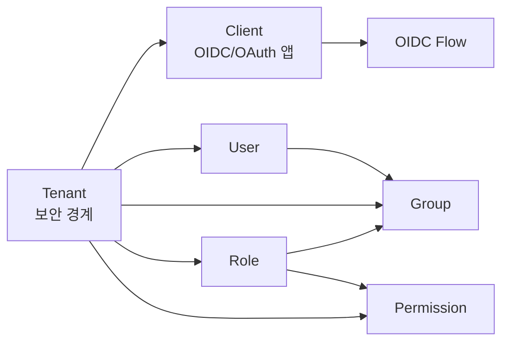
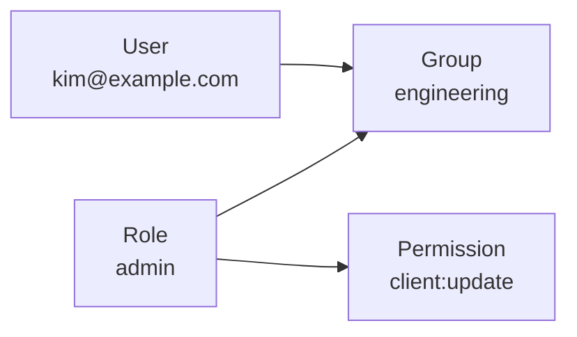
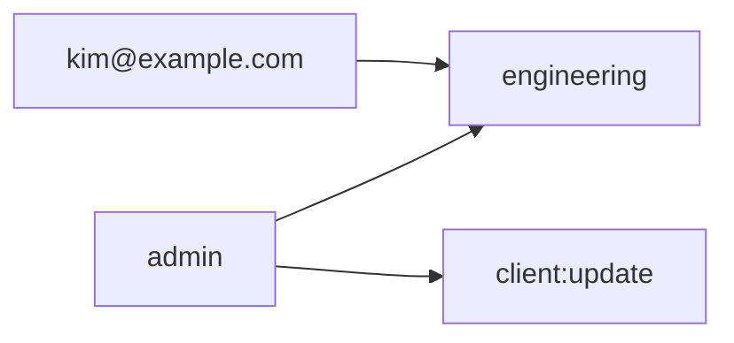

# 핵심 개념

| 항목      | 내용                                                                                 |
| --------- | ------------------------------------------------------------------------------------ |
| 문서 목적 | Auth 시스템을 이해하기 위한 주요 도메인 개념의 관계와 상세 문서 위치를 설명합니다.   |
| 대상 독자 | 관리자, 운영자, 인증 서버 개발자                                                     |
| 관련 화면 | Tenants, Clients, Policies, Identity Providers, Roles, Groups, Users, Interaction UI |

## 전체 관계

Auth 시스템은 tenant를 가장 바깥 경계로 두고, tenant 안에서 client, user, group, role, permission을 관리합니다.



한 줄로 요약하면 다음과 같습니다.

| 개념       | 짧은 정의                                                     |
| ---------- | ------------------------------------------------------------- |
| Tenant     | 인증 서버 안에서 고객, 조직, 서비스 단위를 분리하는 경계      |
| Client     | OIDC/OAuth 로그인을 요청하는 애플리케이션                     |
| OIDC Flow  | authorization code와 token을 발급하는 브라우저 기반 인증 흐름 |
| User       | 인증 대상이 되는 사람 또는 계정                               |
| Group      | 사용자를 묶는 조직 또는 운영 단위                             |
| Role       | 권한 묶음                                                     |
| Permission | 실제 허용되는 동작 또는 리소스 접근 단위                      |

## 상세 개념 문서

| 문서                                               | 설명                                               |
| -------------------------------------------------- | -------------------------------------------------- |
| [OIDC 인증 흐름](./concepts/oidc-flow.md)          | tenant issuer와 Authorization Code + PKCE 흐름     |
| [Tenant 개요](./concepts/tenant/overview.md)       | tenant가 의미하는 보안 경계, issuer, 분리 범위     |
| [Tenant 정책](./concepts/tenant/policies.md)       | tenant 기본 인증, MFA, 세션, 가입 정책             |
| [Client 개요](./concepts/client/overview.md)       | client 타입, redirect URI, logout URI 등 주요 속성 |
| [Client 정책](./concepts/client/policies.md)       | client별 인증 정책과 effective policy              |
| [Grant 개요](./concepts/client/grants/overview.md) | grant type 정책과 검증 기준                        |
| [커스텀 Grant](./concepts/client/grants/custom.md) | 커스텀 OAuth `grant_type` 추가 절차                |
| [Scope 개요](./concepts/client/scopes/overview.md) | scope와 resource indicator                         |
| [커스텀 Scope](./concepts/client/scopes/custom.md) | 서비스별 custom scope 정의 기준                    |
| [MFA 개요](./concepts/mfa.md)                      | MFA 정책, enrollment, 인증 흐름                    |
| [IdP 개요](./concepts/idp.md)                      | 외부 Identity Provider와 OAuth2/SAML 연동          |

## RBAC

RBAC는 Role Based Access Control의 약자입니다. 사용자가 직접 세부 permission을 갖는 대신, role을 통해 권한을 부여하는 방식입니다.

이 시스템의 기본 권장 관계는 다음입니다.



의미:

1. User는 하나 이상의 Group에 속합니다.
2. Group에는 하나 이상의 Role을 부여합니다.
3. Role에는 하나 이상의 Permission을 부여합니다.
4. User는 자신이 속한 Group의 Role을 통해 권한을 얻습니다.

예시:

| 단계       | 예                             |
| ---------- | ------------------------------ |
| User       | `kim@example.com`              |
| Group      | `engineering`                  |
| Role       | `admin`                        |
| Permission | `client:read`, `client:update` |

결과:



즉 `kim@example.com`은 `engineering` 그룹에 속해 있기 때문에 `admin` role이 가진 permission을 사용할 수 있습니다.

## 직접 사용자 Role

현재 시스템은 group을 통한 role 부여뿐 아니라 user에게 직접 role을 부여하는 방식도 지원합니다.

```text
User ← Role → Permission
```

다만 운영 기준으로는 group 기반 부여를 우선 권장합니다.

| 방식                | 권장도      | 이유                                        |
| ------------------- | ----------- | ------------------------------------------- |
| User → Group ← Role | 기본 권장   | 조직 단위 관리, 변경 추적, 권한 회수에 유리 |
| User ← Role         | 예외적 사용 | 임시 권한, 소수 특수 계정 처리에 적합       |

## 운영 원칙

| 원칙                    | 설명                                                        |
| ----------------------- | ----------------------------------------------------------- |
| tenant 먼저 선택        | tenant 범위 리소스는 tenant 선택 후 관리합니다.             |
| client는 앱 단위        | 하나의 서비스 또는 앱마다 client를 분리합니다.              |
| role은 권한 묶음        | 사용자 이름이나 개인 기준으로 role을 만들지 않습니다.       |
| group은 조직 묶음       | 팀, 부서, 운영 단위처럼 변경 가능한 조직 구조를 표현합니다. |
| permission은 작게       | 실제 동작 단위에 가깝게 정의합니다.                         |
| 직접 user role은 최소화 | 가능한 group에 role을 부여해 관리합니다.                    |

## 관련 문서

| 문서                                               | 설명                                         |
| -------------------------------------------------- | -------------------------------------------- |
| [Tenant 개요](./concepts/tenant/overview.md)       | tenant 보안 경계와 issuer                    |
| [Client 개요](./concepts/client/overview.md)       | client 속성과 OIDC/OAuth 설정                |
| [Tenants](./ui/tenants.md)                         | tenant 생성, 선택, 설정                      |
| [Clients](./ui/clients.md)                         | OIDC/OAuth client 관리                       |
| [Grant 개요](./concepts/client/grants/overview.md) | client에 허용하는 OAuth/OIDC grant type 정책 |
| [Scope 개요](./concepts/client/scopes/overview.md) | scope와 resource indicator                   |
| [커스텀 Scope](./concepts/client/scopes/custom.md) | 서비스별 custom scope 정의 기준              |
| [MFA 개요](./concepts/mfa.md)                      | MFA 정책과 등록/인증 흐름                    |
| [IdP 개요](./concepts/idp.md)                      | OAuth2/SAML IdP 연동 구조                    |
| [Tenant 정책](./concepts/tenant/policies.md)       | tenant 기본 정책                             |
| [Client 정책](./concepts/client/policies.md)       | client별 인증 정책                           |
| [Roles / Groups / Users](./ui/access.md)           | RBAC 화면 사용법                             |
| [OIDC 인증 흐름](./concepts/oidc-flow.md)          | tenant issuer와 OIDC 인증 흐름               |
