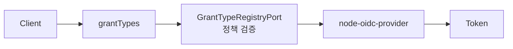

# Grant 개요

Client의 `grantTypes`는 해당 client가 token endpoint 또는 authorization endpoint에서 사용할 수 있는 OAuth/OIDC 흐름입니다.

:::info
여기서 말하는 grant는 client metadata의 `grantTypes` 정책입니다. 사용자 동의 결과를 저장하는 `node-oidc-provider`의 `Grant` 모델과는 다른 개념입니다.
:::



## Grant Type별 의미

| Grant Type             | 용도                                                                 | 권장 client type          | 주요 조건                             |
| ---------------------- | -------------------------------------------------------------------- | ------------------------- | ------------------------------------- |
| `authorization_code`   | 사용자가 브라우저에서 로그인하고 authorization code를 token으로 교환 | `public`, `confidential`  | PKCE `S256` 필수                      |
| `refresh_token`        | access token 만료 후 재발급                                          | `public`, `confidential`  | `authorization_code`와 함께 설정      |
| `client_credentials`   | 사용자 없이 service client가 API 접근 token을 발급                   | `confidential`, `service` | client 인증 필수                      |
| `implicit`             | 브라우저에 token을 직접 반환하는 레거시 흐름                         | 사용 지양                 | 신규 client에서는 피하는 것을 권장    |
| `urn:...` custom grant | 서비스가 확장한 커스텀 token 발급 흐름                               | grant 정의에 따름         | [커스텀 Grant](./custom.md) 기준 적용 |

## 권장 조합

| 시나리오          | Client Type         | Application Type    | Grant Types                                   | Token Endpoint Auth Method                      |
| ----------------- | ------------------- | ------------------- | --------------------------------------------- | ----------------------------------------------- |
| SPA / 모바일 앱   | `public`            | `web` 또는 `native` | `authorization_code`, 필요 시 `refresh_token` | `none`                                          |
| 서버 사이드 웹 앱 | `confidential`      | `web`               | `authorization_code`, 필요 시 `refresh_token` | `client_secret_basic` 또는 `client_secret_post` |
| 서버 간 연동      | `service`           | `web`               | `client_credentials`                          | `client_secret_basic` 또는 `client_secret_post` |
| 커스텀 인증 확장  | `confidential` 권장 | grant 정의에 따름   | `urn:...`                                     | grant 정의에 따름                               |

## Response Types

`responseTypes`는 authorization endpoint가 어떤 응답을 반환할 수 있는지 정합니다.

| Response Type | 의미                    | 권장      |
| ------------- | ----------------------- | --------- |
| `code`        | authorization code 반환 | 기본 권장 |
| `token`       | access token 직접 반환  | 사용 지양 |
| `id_token`    | ID token 직접 반환      | 사용 지양 |

Authorization Code + PKCE 흐름에서는 보통 `responseTypes: ["code"]`를 사용합니다.

## Token Endpoint Auth Method

`tokenEndpointAuthMethod`는 token endpoint에서 client를 인증하는 방법입니다.

| 값                    | 의미                                      | 권장 client           |
| --------------------- | ----------------------------------------- | --------------------- |
| `none`                | client secret 없이 요청. PKCE 등으로 보완 | public                |
| `client_secret_basic` | HTTP Basic으로 client secret 전달         | confidential, service |
| `client_secret_post`  | request body로 client secret 전달         | confidential, service |
| `private_key_jwt`     | private key로 client assertion 서명       | confidential, service |

## 검증 정책

Client 저장 시 `GrantTypeRegistryPort`가 다음 기준으로 `grantTypes`를 검증합니다.

| 검증 기준        | 설명                                                       |
| ---------------- | ---------------------------------------------------------- |
| 지원 여부        | 내장 grant 또는 등록된 `urn:...` custom grant만 허용       |
| 활성화 여부      | disabled grant는 client에 설정 불가                        |
| Client Type      | grant별 허용 client type과 일치해야 함                     |
| Application Type | grant별 허용 application type과 일치해야 함                |
| Client 인증      | 인증이 필요한 grant는 `tokenEndpointAuthMethod: none` 불가 |
| 의존 grant       | `refresh_token`은 `authorization_code`와 함께 설정해야 함  |

## Authorization Code와 Refresh Token 관계

`refresh_token`은 독립적인 로그인 시작 흐름이 아닙니다. 먼저 `authorization_code` 흐름으로 사용자 인증과 동의를 완료한 뒤, 발급된 refresh token을 token endpoint에 제출해 access token을 재발급하는 흐름입니다.

```text
grant_type=refresh_token
&client_id=web
&refresh_token=...
```

## 운영 기준

| 기준           | 설명                                                  |
| -------------- | ----------------------------------------------------- |
| 최소 권한      | client가 실제 사용하는 grant만 허용                   |
| Public client  | secret을 보관할 수 없으므로 `client_credentials` 금지 |
| Service client | 사용자 로그인 흐름과 분리하고 scope를 최소화          |
| Legacy 흐름    | `implicit`은 신규 연동에서 사용하지 않음              |
| Custom grant   | 구현 문서, 보안 검토, 테스트가 준비된 grant만 활성화  |

## 관련 문서

| 문서                                 | 설명                                |
| ------------------------------------ | ----------------------------------- |
| [Client 개요](../overview.md)        | client 주요 속성                    |
| [커스텀 Grant](./custom.md)          | 커스텀 OAuth `grant_type` 추가 절차 |
| [Scope 개요](../scopes.md)           | scope와 resource indicator          |
| [OIDC 인증 흐름](../../oidc-flow.md) | Authorization Code + PKCE 흐름      |
