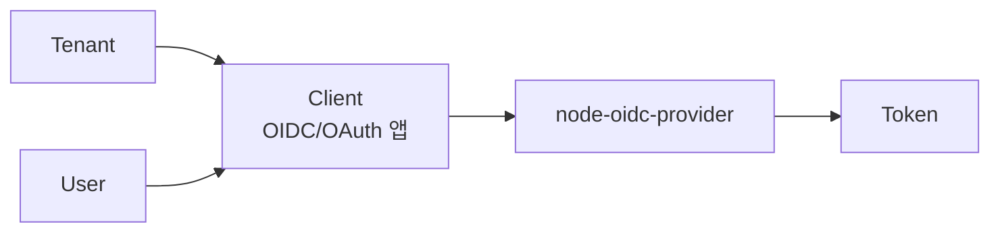

# Client 개요

| 항목      | 내용                                                   |
| --------- | ------------------------------------------------------ |
| 문서 목적 | client의 의미, 타입, 주요 속성의 큰 그림을 설명합니다. |
| 대상 독자 | 관리자, OIDC client 연동 담당자, 인증 서버 개발자      |
| 관련 화면 | 관리자 UI `/admin/clients`                             |

## 정의

Client는 OIDC/OAuth 인증을 요청하는 애플리케이션입니다. 사용자가 로그인하려는 웹 서비스, 모바일 앱, 관리자 콘솔, 서버 사이드 애플리케이션, machine-to-machine 애플리케이션이 모두 client가 될 수 있습니다.

Client는 항상 특정 [Tenant](../tenant/overview.md)에 속합니다.



:::info
Client는 애플리케이션 단위의 보안 정책입니다. 하나의 앱에서 관리자 콘솔, 일반 사용자 웹, 배치 작업처럼 성격이 다르면 client를 분리하는 편이 안전합니다.
:::

## Client Type

| Type           | 대표 용도          | 특징                                    | 권장 grant                            |
| -------------- | ------------------ | --------------------------------------- | ------------------------------------- |
| `public`       | SPA, 모바일 앱     | secret을 안전하게 보관할 수 없음        | `authorization_code` + PKCE           |
| `confidential` | 서버 사이드 웹 앱  | 서버에서 secret을 보관 가능             | `authorization_code`, `refresh_token` |
| `service`      | machine-to-machine | 사용자 브라우저 없이 서버 간 token 발급 | `client_credentials`                  |

운영 기준:

- public client는 `tokenEndpointAuthMethod: none`과 PKCE를 사용합니다.
- confidential/service client는 client secret 또는 private key 기반 인증을 사용합니다.
- 사용자 로그인 client와 서버 간 통신 client는 분리합니다.

## Application Type

| 값       | 의미                                        |
| -------- | ------------------------------------------- |
| `web`    | 서버 사이드 웹 앱, SPA, 일반 웹 기반 client |
| `native` | 모바일 앱, 데스크톱 앱 등 native client     |

grant 정책 검증은 client type과 application type을 함께 봅니다.

## 주요 속성

| 속성                      | 의미                                                      | 상세                               |
| ------------------------- | --------------------------------------------------------- | ---------------------------------- |
| `clientId`                | OIDC 요청의 `client_id`. 외부에 노출되는 식별자           | 이 문서                            |
| `name`                    | 관리자 화면에서 볼 client 표시 이름                       | 이 문서                            |
| `enabled`                 | client 사용 가능 여부                                     | 이 문서                            |
| `secret` / `secretEnc`    | confidential/service client 인증용 secret. 저장 시 암호화 | 이 문서                            |
| `redirectUris`            | 로그인 완료 후 authorization code를 돌려받을 callback URI | 이 문서                            |
| `postLogoutRedirectUris`  | logout 이후 redirect를 허용할 URI                         | 이 문서                            |
| `grantTypes`              | client가 사용할 수 있는 OAuth grant 흐름                  | [Grant 개요](./grants/overview.md) |
| `responseTypes`           | authorization endpoint가 반환할 응답 방식                 | [Grant 개요](./grants/overview.md) |
| `tokenEndpointAuthMethod` | token endpoint에서 client를 인증하는 방식                 | [Grant 개요](./grants/overview.md) |
| `scope`                   | client가 요청할 수 있는 scope 목록                        | [Scope 개요](./scopes.md)          |
| `allowedResources`        | resource indicator로 요청 가능한 API resource origin      | [Scope 개요](./scopes.md)          |
| `skipConsent`             | 신뢰된 client에서 사용자 동의 화면을 생략할지 여부        | [Client 정책](./policies.md)       |
| `accessTokenTtlSec`       | client별 access token TTL override                        | [Client 정책](./policies.md)       |
| `refreshTokenTtlSec`      | client별 refresh token TTL override                       | [Client 정책](./policies.md)       |
| `backchannelLogoutUri`    | back-channel logout 알림 URI                              | 이 문서                            |
| `frontchannelLogoutUri`   | front-channel logout 알림 URI                             | 이 문서                            |

## Client ID

`clientId`는 OIDC/OAuth 요청에서 client를 식별하는 값입니다.

```text
client_id=my-web-app
```

운영 기준:

- 생성 후 바꾸지 않는 값으로 다룹니다.
- secret이 아니므로 외부 요청 URL에 노출될 수 있습니다.
- tenant 안에서 고유해야 합니다.
- 사람이 식별 가능한 앱 단위 이름을 권장합니다.

## Redirect URI

`redirectUris`는 authorization code flow가 끝난 뒤 authorization code를 돌려받을 callback URI입니다.

| 기준          | 설명                                                                              |
| ------------- | --------------------------------------------------------------------------------- |
| 정확한 일치   | scheme, host, path, port까지 등록값과 맞아야 합니다.                              |
| HTTPS 권장    | production에서는 HTTPS를 사용합니다. localhost 개발 환경은 예외가 될 수 있습니다. |
| 최소 등록     | 실제 사용하는 callback만 등록합니다.                                              |
| wildcard 지양 | 넓은 redirect 허용은 code 탈취 위험을 키웁니다.                                   |

:::caution
redirect URI 검증을 애플리케이션 코드에서 직접 재구현하지 않습니다. OIDC provider의 검증에 위임합니다.
:::

## Logout URI

| 속성                     | 의미                                          |
| ------------------------ | --------------------------------------------- |
| `postLogoutRedirectUris` | RP initiated logout 이후 돌아갈 URI           |
| `backchannelLogoutUri`   | 브라우저 없이 서버 간 logout 알림을 받을 URI  |
| `frontchannelLogoutUri`  | 브라우저 iframe/redirect 기반 logout 알림 URI |

production URI는 HTTPS를 사용하고, 로그인 callback과 logout callback은 목적에 맞게 분리하는 편이 좋습니다.

## 운영 체크리스트

| 체크            | 기준                                                     |
| --------------- | -------------------------------------------------------- |
| 앱 단위 분리    | 사용자 웹, 관리자 콘솔, M2M 작업은 client를 분리         |
| redirect 최소화 | 실제 callback URI만 등록                                 |
| grant 최소화    | 사용하지 않는 grant는 등록하지 않음                      |
| scope 최소화    | 필요한 scope만 허용                                      |
| public client   | secret 사용 금지, PKCE 필수                              |
| service client  | 사용자 로그인 scope와 분리                               |
| token logging   | code, access token, refresh token, secret 원문 로그 금지 |

## 관련 문서

| 문서                               | 설명                                         |
| ---------------------------------- | -------------------------------------------- |
| [Client 정책](./policies.md)       | client auth policy와 effective policy        |
| [Grant 개요](./grants/overview.md) | grant type, response type, token auth method |
| [Scope 개요](./scopes.md)          | scope와 resource indicator                   |
| [Clients](../../ui/clients.md)     | 관리자 UI client 관리 화면                   |
