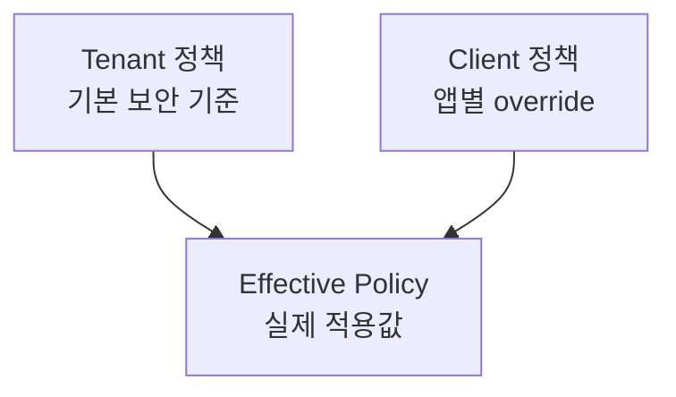

# Client 정책

Client 정책은 특정 client의 로그인 방식, MFA 방식, 동의 요구, 세션/refresh token 정책을 조정합니다. tenant 정책은 기본값이고, client 정책은 그 위에서 더 좁거나 구체적인 조건을 적용합니다.

## 인증 방식

| 필드                 | 기본값         | 설명                                        |
| -------------------- | -------------- | ------------------------------------------- |
| `allowedAuthMethods` | `["password"]` | 허용 사용자 인증 방식                       |
| `defaultAcr`         | `urn:auth:pwd` | 기본 Authentication Context Class Reference |

허용 값:

| 필드                 | 값                                           |
| -------------------- | -------------------------------------------- |
| `allowedAuthMethods` | `password`, `totp`, `webauthn`, `magic_link` |

## MFA

| 필드                | 기본값     | 설명                     |
| ------------------- | ---------- | ------------------------ |
| `mfaRequired`       | `false`    | 해당 client에 MFA를 요구 |
| `allowedMfaMethods` | `["totp"]` | 허용 MFA 방식            |

허용 값:

| 필드                | 값                                  |
| ------------------- | ----------------------------------- |
| `allowedMfaMethods` | `totp`, `webauthn`, `recovery_code` |

tenant MFA가 필수이면 client `mfaRequired`가 `false`여도 실제 적용값은 필수입니다.

MFA 방식과 enrollment 흐름은 [MFA 개요](../mfa.md)를 참고하세요.

## Consent

| 필드              | 기본값          | 설명                                                |
| ----------------- | --------------- | --------------------------------------------------- |
| `consentRequired` | `true`          | scope 동의 화면 표시 여부                           |
| `skipConsent`     | client metadata | 신뢰된 client에서 consent 없이 Grant 자동 생성 여부 |

운영 기준:

- 외부 또는 제3자 client는 consent를 유지합니다.
- 1st-party client에서 동의를 생략하려면 client 신뢰 경계와 scope를 먼저 검토합니다.
- scope 의미는 [Scope 개요](./scopes.md)를 함께 확인합니다.

## Session / Reauthentication

| 필드                          | 기본값  | 설명                                |
| ----------------------------- | ------- | ----------------------------------- |
| `maxSessionDurationSec`       | `null`  | client별 세션 최대 수명 override    |
| `requireAuthTime`             | `false` | 해당 client에서 인증 시각 검증 요구 |
| `reauthenticationIntervalSec` | `null`  | client별 재인증 간격 override       |

tenant `requireAuthTime`이 `true`이면 client에서 낮출 수 없습니다.

## Client별 IdP 제한

| 필드                     | 기본값 | 설명                                         |
| ------------------------ | ------ | -------------------------------------------- |
| `allowedIdpProviderKeys` | `null` | 해당 client에서 허용할 IdP provider key 목록 |

`null`이면 tenant의 `allowedIdp.providerKeys`를 따릅니다. 빈 배열은 허용 IdP가 없다는 의미가 될 수 있으므로 로그인 방식과 함께 신중히 설정합니다.

OAuth2/SAML IdP 연동 구조는 [IdP 개요](../idp.md)를 참고하세요.

## Refresh Token

| 필드                          | 기본값         | 설명                                |
| ----------------------------- | -------------- | ----------------------------------- |
| `refreshTokenRotationEnabled` | `true`         | client별 rotation 사용 여부         |
| `refreshTokenReuseAction`     | `revoke_grant` | reuse 감지 시 조치                  |
| `refreshTokenTtlSec`          | tenant 기본값  | client별 refresh token TTL override |

public client는 refresh token 탈취 위험이 크므로 rotation을 끄지 않습니다. refresh token 원문은 audit log, application log, error response에 남기지 않습니다.

## Effective Policy

Client auth policy 응답의 `effective` 값이 실제 로그인/세션 흐름에 적용됩니다.

| Effective 필드                | 계산 기준                                                                       |
| ----------------------------- | ------------------------------------------------------------------------------- |
| `mfaRequired`                 | `tenant.mfa.required OR client.mfaRequired`                                     |
| `allowedIdpProviderKeys`      | client 값이 있으면 client 값, 없으면 tenant 값                                  |
| `maxSessionDurationSec`       | client 값이 있으면 client 값, 없으면 tenant 값                                  |
| `requireAuthTime`             | `tenant.session.requireAuthTime OR client.requireAuthTime`                      |
| `reauthenticationIntervalSec` | client 값이 있으면 client 값, 없으면 tenant 값                                  |
| `refreshTokenTtlSec`          | client `refreshTokenTtlSec`가 있으면 client 값, 없으면 tenant refresh token TTL |

## 관련 문서

| 문서                                         | 설명                       |
| -------------------------------------------- | -------------------------- |
| [Client 개요](./overview.md)                 | client 주요 속성           |
| [Tenant 정책](../tenant/policies.md)         | tenant 기본 정책           |
| [MFA 개요](../mfa.md)                        | MFA 등록과 인증 흐름       |
| [IdP 개요](../idp.md)                        | OAuth2/SAML IdP 연동 구조  |
| [Tenant Policies 화면](../../ui/policies.md) | 관리자 UI 정책 화면 사용법 |
