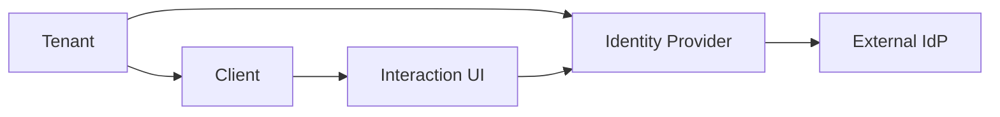
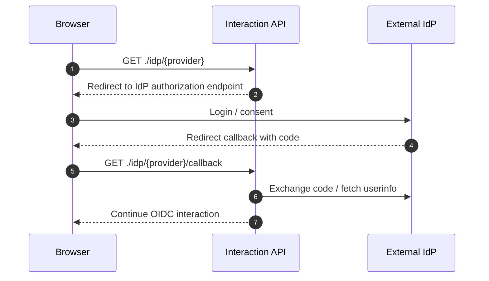

# IdP

IdP는 Identity Provider의 약자입니다. Auth 시스템이 직접 비밀번호를 검증하는 대신, Google, Okta, 사내 SSO, SAML IdP 같은 외부 인증 제공자를 통해 사용자를 인증할 수 있게 합니다.

## 지원 프로토콜

| Protocol                | 용도                                               | 주요 설정                                                       |
| ----------------------- | -------------------------------------------------- | --------------------------------------------------------------- |
| OAuth 2.0 / OIDC 스타일 | Google, Kakao, Naver, Apple, 커스텀 OAuth provider | client ID, client secret, authorization/token/userinfo endpoint |
| SAML 2.0                | Okta, Azure AD, 사내 SAML SSO                      | SSO URL, IdP certificate, issuer, audience, assertion 서명 정책 |

:::caution
OAuth client secret, SAML certificate private material, IdP token 응답은 UI 로그, application log, audit metadata에 남기지 않습니다.
:::

## Tenant와 IdP

IdP 설정은 tenant별로 분리됩니다. 같은 Google 또는 Okta 연동이라도 tenant가 다르면 provider key, client ID, secret, certificate를 별도로 관리합니다.

## Provider Key

`provider key`는 tenant 안에서 IdP를 식별하는 slug입니다.

| 기준 | 설명                                                                   |
| ---- | ---------------------------------------------------------------------- |
| 예시 | `google`, `okta-workforce`, `corp-saml`                                |
| 표시 | Interaction UI의 외부 로그인 버튼과 연결                               |
| 정책 | tenant/client 정책의 `providerKeys`, `allowedIdpProviderKeys`에서 참조 |

## OAuth2 IdP

OAuth2 기반 IdP는 authorization endpoint로 브라우저를 보내고, callback에서 code를 받아 token/userinfo를 조회하는 흐름입니다.

## SAML 2.0 IdP

SAML IdP는 Service Provider metadata, ACS callback, assertion 검증 정책이 중요합니다.

| 설정                        | 의미                                              |
| --------------------------- | ------------------------------------------------- |
| `IdP SSO URL`               | SAML login 요청을 보낼 endpoint                   |
| `IdP certificate`           | assertion 또는 response 서명 검증에 사용할 인증서 |
| `Audience`                  | assertion이 대상으로 하는 SP 식별자               |
| `Require signed assertions` | assertion 서명 필수 여부                          |
| `Require signed response`   | response 서명 필수 여부                           |
| `Accepted clock skew`       | 시간 오차 허용 범위                               |

운영 환경에서는 assertion 또는 response 서명 검증을 끄지 않는 것이 안전합니다.

## Client 정책과 IdP 제한

Tenant 정책은 tenant 전체에서 허용할 IdP 목록을 정하고, Client 정책은 특정 client에서 더 좁은 IdP 목록을 적용할 수 있습니다.

| 정책                             | 의미                            |
| -------------------------------- | ------------------------------- |
| `tenant.allowedIdp.providerKeys` | tenant 전체 허용 IdP 목록       |
| `client.allowedIdpProviderKeys`  | 특정 client에서 허용할 IdP 목록 |

`client.allowedIdpProviderKeys`가 `null`이면 tenant 정책을 따릅니다.

## 관련 문서

| 문서                                              | 설명                        |
| ------------------------------------------------- | --------------------------- |
| [Identity Providers](../ui/identity-providers.md) | 관리자 UI IdP 설정 화면     |
| [Tenant 정책](./tenant/policies.md)               | tenant allowed IdP 정책     |
| [Client 정책](./client/policies.md)               | client별 IdP 제한           |
| [OIDC 인증 흐름](./oidc-flow.md)                  | Interaction과 외부 IdP 흐름 |
