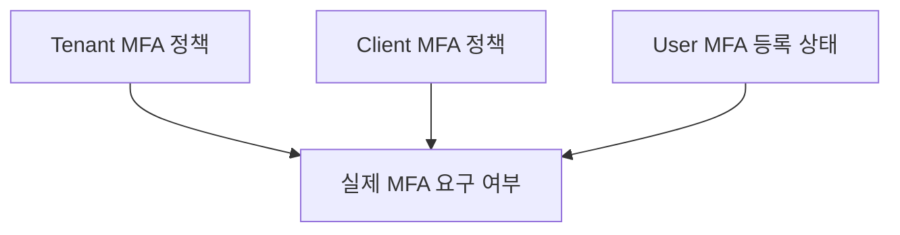
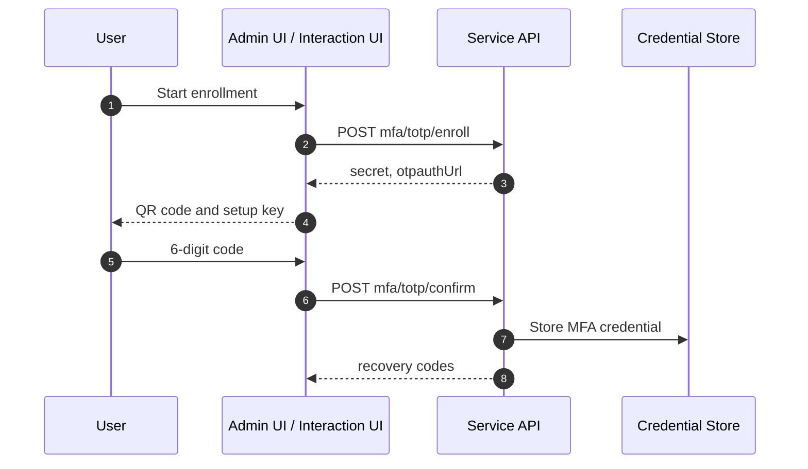

# MFA 개요

MFA는 Multi-Factor Authentication의 약자입니다. 비밀번호 같은 1차 인증만으로 로그인하지 않고, 사용자가 보유한 추가 인증 수단을 확인해 계정 탈취 위험을 낮춥니다.

## 지원 방식

| 방식            | 의미                                        | 사용 위치                          |
| --------------- | ------------------------------------------- | ---------------------------------- |
| `totp`          | 인증 앱의 6자리 일회용 코드                 | Admin UI 보안 설정, Interaction UI |
| `webauthn`      | 브라우저/기기 기반 공개키 인증              | Interaction MFA 검증               |
| `recovery_code` | MFA 수단을 사용할 수 없을 때 쓰는 복구 코드 | Admin UI 보안 설정, Interaction UI |

:::caution
TOTP secret, WebAuthn credential 원문, recovery code 원문은 로그, audit metadata, error response에 남기지 않습니다.
:::

## 정책 적용 위치

MFA 요구 여부는 세 층에서 결정됩니다.

| 기준        | 설명                                                       |
| ----------- | ---------------------------------------------------------- |
| Tenant 정책 | tenant 전체 사용자 또는 관리자에게 MFA를 강제              |
| Client 정책 | 특정 client 로그인에 MFA를 강제하거나 허용 MFA 방식을 제한 |
| User 상태   | 사용자가 MFA를 등록했는지, recovery code가 남아 있는지     |

tenant MFA가 필수이면 client에서 MFA를 끌 수 없습니다.

## Enrollment 흐름

TOTP enrollment는 사용자가 인증 앱에 secret을 등록하고, 코드를 검증한 뒤 MFA를 활성화하는 흐름입니다.

운영 기준:

- `otpauthUrl`과 secret은 등록 화면에서만 보여줍니다.
- recovery code는 발급 직후 한 번만 보여주고 안전한 곳에 보관하도록 안내합니다.
- recovery code를 재발급하면 기존 코드는 폐기됩니다.

## Interaction MFA

OIDC authorize 중 MFA가 필요하면 Interaction UI가 MFA 화면으로 전환됩니다.

| 상황                          | 동작                              |
| ----------------------------- | --------------------------------- |
| MFA 필요, 사용자가 MFA 등록됨 | `POST ./api/mfa`로 MFA 검증       |
| MFA 필요, 등록된 수단 없음    | TOTP enrollment 화면 표시         |
| recovery code 사용            | 검증 후 해당 recovery code를 소비 |

## 관련 문서

| 문서                                                   | 설명                                 |
| ------------------------------------------------------ | ------------------------------------ |
| [Tenant 정책](./tenant/policies.md)                    | tenant MFA 기본 정책                 |
| [Client 정책](./client/policies.md)                    | client별 MFA 요구와 허용 방식        |
| [Security](../ui/security.md)                          | 사용자 MFA 등록과 recovery code 관리 |
| [Interaction UI 커스터마이징](../ui/interaction-ui.md) | MFA 화면 커스터마이징                |
