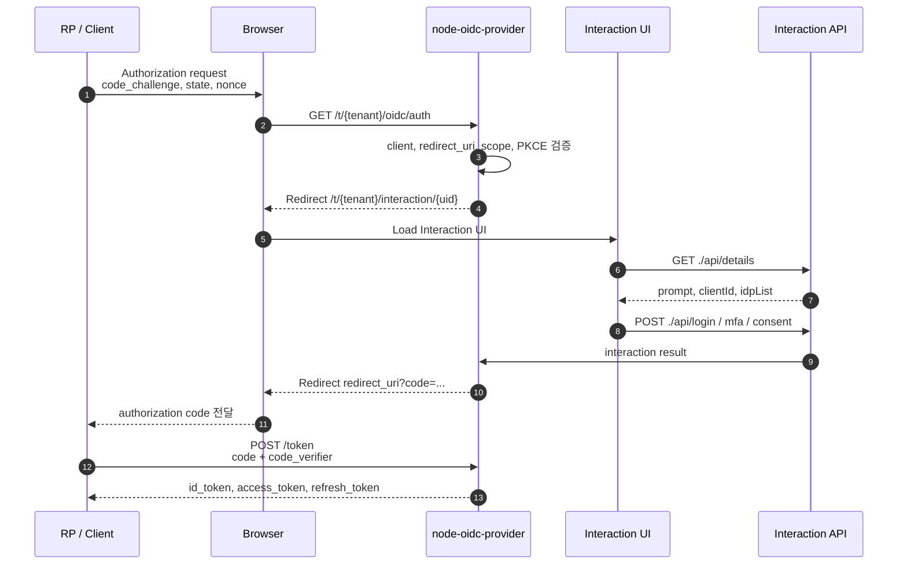

# OIDC 인증 흐름

| 항목           | 내용                                                                                                         |
| -------------- | ------------------------------------------------------------------------------------------------------------ |
| 문서 목적      | RP가 OIDC 로그인 요청을 시작한 뒤 code, token, userinfo까지 이어지는 전체 흐름을 설명합니다.                 |
| 대상 독자      | 인증 서버 개발자, Client 연동 담당자, 운영자                                                                 |
| 원본 운영 문서 | `service/docs/OIDC.md`                                                                                       |
| 주요 코드 위치 | `service/src/infrastructure/oidc-provider`, `service/src/presentation/controllers/interaction.controller.ts` |

## 개요

이 서비스는 `node-oidc-provider`를 OIDC 프로토콜 엔진으로 사용합니다. Authorization endpoint, token endpoint, PKCE 검증, code 발급, token 서명은 provider가 처리하고, 서비스 코드는 tenant 분리, interaction UI, 사용자 조회, client 정책, audit, persistence를 연결합니다.

:::info
기본 권장 흐름은 Authorization Code + PKCE입니다. public client와 confidential client 모두 PKCE가 요구됩니다.
:::

## 참여 구성 요소

| 구성 요소                | 역할                                                            |
| ------------------------ | --------------------------------------------------------------- |
| RP / Client              | OIDC 로그인 요청을 시작하고 authorization code를 token으로 교환 |
| Browser                  | 사용자 로그인, 동의, MFA 화면을 이동                            |
| `OidcDelegateMiddleware` | `/t/:tenantCode/oidc/*` 요청을 tenant별 provider로 위임         |
| `node-oidc-provider`     | OIDC/OAuth2 프로토콜 처리                                       |
| `InteractionController`  | 로그인, 동의, MFA, 외부 IdP interaction API 제공                |
| `service/interaction-ui` | 최종 사용자가 보는 로그인/동의/MFA SPA                          |
| OIDC Adapter             | Session, Interaction, Grant, Token 등 provider 모델 저장        |

## Tenant 기준 Issuer

issuer는 tenant별로 분리됩니다.

```text
{OIDC_ISSUER}/t/{tenantCode}/oidc
```

예:

```text
http://localhost:3000/t/acme/oidc
```

RP는 discovery 문서를 기준으로 authorization, token, userinfo, jwks endpoint를 확인해야 합니다.

```text
GET /t/:tenantCode/oidc/.well-known/openid-configuration
```

## Authorization Code + PKCE 흐름



| 단계 | 주체            | 설명                                                                        |
| ---- | --------------- | --------------------------------------------------------------------------- |
| 1    | RP              | `code_verifier`와 `code_challenge`를 생성합니다.                            |
| 2    | Browser         | `/t/:tenantCode/oidc/auth`로 authorization request를 보냅니다.              |
| 3    | Provider        | client, redirect URI, scope, response type, PKCE를 검증합니다.              |
| 4    | Provider        | 로그인이 필요하면 interaction URL로 redirect합니다.                         |
| 5    | Interaction UI  | `/api/details`로 prompt 상태를 조회하고 로그인/동의/MFA 화면을 표시합니다.  |
| 6    | Interaction API | 로그인, MFA, 동의 처리를 수행하고 provider에 interaction 결과를 반환합니다. |
| 7    | Provider        | authorization code를 발급하고 RP의 `redirect_uri`로 redirect합니다.         |
| 8    | RP              | `/token`에 code와 `code_verifier`를 보내 token으로 교환합니다.              |
| 9    | Provider        | PKCE verifier와 code를 검증하고 token을 발급합니다.                         |
| 10   | RP              | access token으로 `/userinfo`를 호출해 사용자 claims를 조회합니다.           |

요청 예:

```text
GET /t/acme/oidc/auth
  ?client_id=web
  &response_type=code
  &scope=openid profile email
  &redirect_uri=https%3A%2F%2Fapp.example.com%2Fcallback
  &code_challenge=...
  &code_challenge_method=S256
  &state=...
  &nonce=...
```

## Interaction 처리

Provider가 사용자 입력이 필요하다고 판단하면 아래 경로로 이동합니다.

```text
/t/:tenantCode/interaction/:uid
```

Interaction UI는 같은 pathname 아래의 API를 호출합니다.

```text
GET  ./api/details
POST ./api/login
POST ./api/mfa
POST ./api/mfa/totp/enroll
POST ./api/mfa/totp/confirm
POST ./api/consent
GET  ./api/abort
GET  ./idp/:provider
```

주요 prompt:

| prompt    | 화면                                  | 완료 결과                                      |
| --------- | ------------------------------------- | ---------------------------------------------- |
| `login`   | 로그인, 외부 IdP, MFA, MFA enrollment | `accountId`를 provider에 전달                  |
| `consent` | scope 동의                            | `Grant`를 저장하고 `grantId`를 provider에 전달 |

## Token 교환

RP는 redirect로 받은 code를 token endpoint에 제출합니다.

```text
POST /t/:tenantCode/oidc/token
Content-Type: application/x-www-form-urlencoded

grant_type=authorization_code
&client_id=web
&code=...
&redirect_uri=https%3A%2F%2Fapp.example.com%2Fcallback
&code_verifier=...
```

Provider는 다음을 검증합니다.

| 검증 대상          | 설명                                                         |
| ------------------ | ------------------------------------------------------------ |
| authorization code | 미사용, 만료 전, 해당 client와 redirect URI에 바인딩         |
| PKCE               | `code_verifier`가 `code_challenge`와 일치                    |
| client 인증        | confidential client는 등록된 token endpoint auth method 사용 |
| grant type         | client의 `grantTypes` 정책에 포함                            |

## UserInfo 조회

access token 발급 후 RP는 userinfo endpoint를 호출할 수 있습니다.

```text
GET /t/:tenantCode/oidc/userinfo
Authorization: Bearer {access_token}
```

현재 기본 claims:

| claim            | 설명             |
| ---------------- | ---------------- |
| `sub`            | 사용자 식별자    |
| `email`          | 이메일           |
| `email_verified` | 이메일 검증 여부 |

민감정보, credential, 내부 정책 상태는 claims로 노출하지 않습니다.

## Refresh Token과 Logout

| 기능          | Endpoint                          | 설명                                               |
| ------------- | --------------------------------- | -------------------------------------------------- |
| Refresh token | `POST /t/:tenantCode/oidc/token`  | `grant_type=refresh_token`으로 access token 재발급 |
| Token revoke  | `POST /t/:tenantCode/oidc/revoke` | token 폐기                                         |
| End session   | `/t/:tenantCode/oidc/session/end` | RP initiated logout                                |

Refresh token rotation 정책은 client auth policy에 따라 결정됩니다. 재사용 감지 시 grant revoke와 audit event 저장 흐름이 동작합니다.

## 보안 기준

| 기준               | 설명                                                           |
| ------------------ | -------------------------------------------------------------- |
| PKCE               | 모든 authorization code 흐름에서 필수, `S256` 사용             |
| Redirect URI       | provider 검증에 위임하고 client metadata와 정확히 일치해야 함  |
| Tenant binding     | issuer, provider instance, 저장소 조회는 tenant 기준으로 분리  |
| Token logging      | access token, refresh token, authorization code 원문 로그 금지 |
| Resource indicator | HTTPS origin만 허용하고 client 허용 resource와 비교            |

## 문제 해결

| 증상                          | 확인 지점                                                            |
| ----------------------------- | -------------------------------------------------------------------- |
| `invalid_redirect_uri`        | client의 redirect URI 등록값과 요청값 일치 여부                      |
| `invalid_grant`               | code 만료, code 재사용, PKCE verifier 불일치                         |
| interaction 화면 404          | `service/interaction-ui/dist` 빌드 여부와 `/interaction-assets` 경로 |
| token endpoint에서 grant 거부 | client `grantTypes`와 registry 정책                                  |
| userinfo claims 누락          | `findAccount`와 `UserQueryPort.findClaimsBySub()` 결과               |
