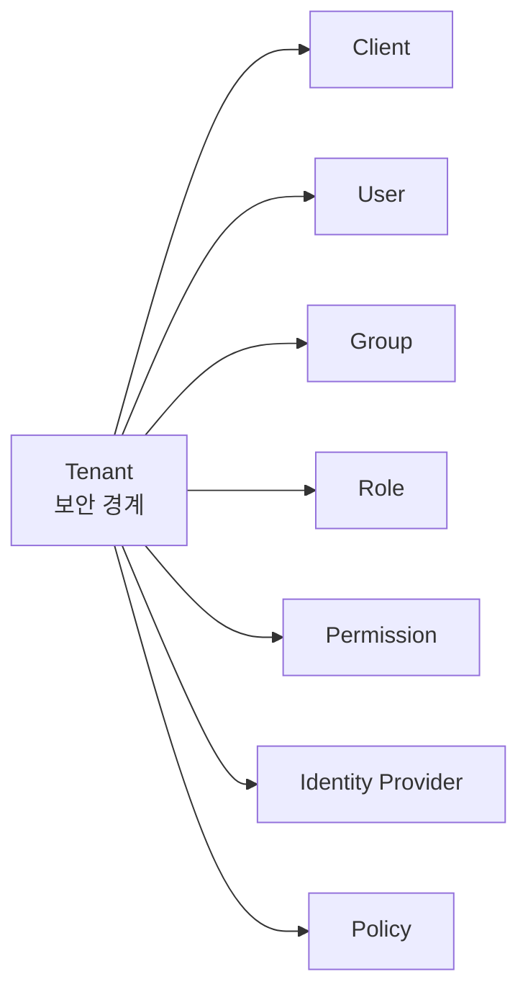

# Tenant 개요

| 항목      | 내용                                                           |
| --------- | -------------------------------------------------------------- |
| 문서 목적 | tenant의 의미, 분리 범위, issuer 구조, 운영 기준을 설명합니다. |
| 대상 독자 | 관리자, 운영자, 인증 서버 개발자                               |
| 관련 화면 | 관리자 UI `/admin/tenants`                                     |

## 정의

Tenant는 Auth 시스템 안에서 고객, 조직, 서비스 단위를 분리하는 최상위 보안 경계입니다. 하나의 tenant는 자체 client, user, group, role, permission, policy, identity provider 설정을 가집니다.



:::caution
tenant는 단순한 화면 필터가 아닙니다. token, client, user, role, policy는 모두 tenant 경계 안에서 해석해야 하며 cross-tenant 접근은 차단되어야 합니다.
:::

## 예시

| Tenant      | 의미                              |
| ----------- | --------------------------------- |
| `master`    | 시스템 운영 또는 기본 관리 tenant |
| `acme`      | Acme 조직 전용 인증 영역          |
| `partner-a` | 외부 파트너 서비스 전용 인증 영역 |

## Tenant가 분리하는 것

| 리소스                    | 분리 의미                                       |
| ------------------------- | ----------------------------------------------- |
| Client                    | tenant별 OIDC/OAuth client를 별도로 등록        |
| User                      | tenant 안에서 인증 대상 계정을 관리             |
| Group / Role / Permission | tenant별 RBAC 정책을 독립 관리                  |
| Identity Provider         | tenant별 OAuth2/SAML IdP 설정                   |
| Consent                   | tenant, user, client 기준으로 사용자 동의 관리  |
| Audit Log                 | tenant 범위 작업과 보안 이벤트 추적             |
| Policy                    | tenant 기본 인증, MFA, 세션, refresh token 정책 |

## Tenant Issuer

OIDC issuer는 tenant별 경로를 가집니다.

```text
{OIDC_ISSUER}/t/{tenantCode}/oidc
```

예:

```text
http://localhost:3000/t/acme/oidc
```

RP 또는 client는 tenant별 discovery 문서에서 authorization, token, userinfo, jwks endpoint를 확인해야 합니다.

```text
GET /t/:tenantCode/oidc/.well-known/openid-configuration
```

## Tenant Code

`tenantCode`는 URL 경로와 issuer에 들어가는 tenant 식별자입니다.

| 기준       | 설명                                                        |
| ---------- | ----------------------------------------------------------- |
| 안정성     | 생성 후 바꾸지 않는 값으로 다룹니다.                        |
| URL 안전성 | 소문자, 숫자, 하이픈 조합을 권장합니다.                     |
| 외부 노출  | issuer와 API 경로에 노출되므로 내부 비밀값을 넣지 않습니다. |

## Tenant 설정

관리자 UI `/admin/tenants`에서 다루는 기본 필드는 다음입니다.

| 필드                         | 의미                                           |
| ---------------------------- | ---------------------------------------------- |
| `Code`                       | tenant 식별자. 생성 후 수정하지 않습니다.      |
| `Name`                       | 관리자 화면에서 볼 tenant 이름                 |
| `Brand Name`                 | 로그인 UI, 알림, 운영 화면에서 사용할 브랜드명 |
| `Signup Policy`              | 가입 허용 방식. `invite` 또는 `open`           |
| `Require Phone Verification` | 전화번호 인증 필수 여부                        |

더 넓은 인증, MFA, 세션, refresh token 정책은 [Tenant 정책](./policies.md)에서 다룹니다.

## 운영 기준

| 기준                 | 설명                                                                        |
| -------------------- | --------------------------------------------------------------------------- |
| tenant 먼저 선택     | tenant 범위 리소스는 tenant 선택 후 관리합니다.                             |
| tenant별 client 분리 | 같은 애플리케이션이라도 tenant가 다르면 client도 분리합니다.                |
| tenant별 IdP 분리    | 같은 Okta/Google 연동이라도 tenant별 provider key와 secret을 분리합니다.    |
| audit 기준           | admin 작업과 보안 이벤트에는 tenantId 또는 tenantCode가 포함되어야 합니다.  |
| secret 금지          | tenant code, name, brand name에 secret이나 내부 credential을 넣지 않습니다. |

## 관련 문서

| 문서                              | 설명                               |
| --------------------------------- | ---------------------------------- |
| [Tenant 정책](./policies.md)      | tenant 기본 정책                   |
| [Tenants](../../ui/tenants.md)    | tenant 생성, 선택, 설정 화면       |
| [OIDC 인증 흐름](../oidc-flow.md) | tenant issuer와 authorization flow |
