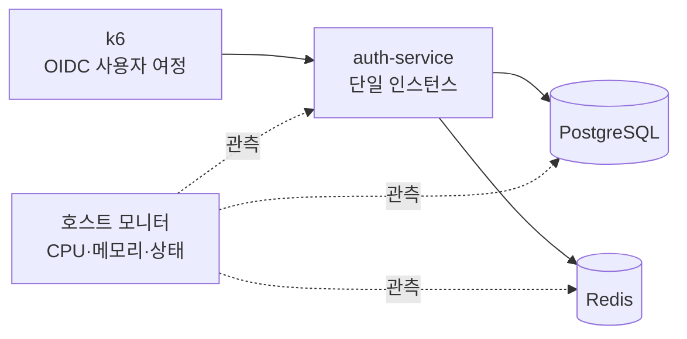
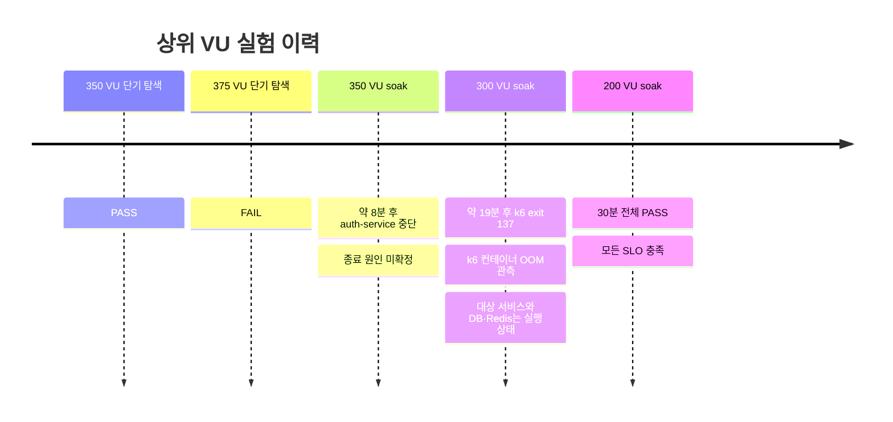

# 로컬 부하 테스트 결과 — 2026-09-02

## 결론

> **현재 Docker 할당 조건에서 200 동시 VU가 30분 동안 모든 SLO를 만족했다.**  
> 따라서 검증된 용량은 **최소 200 VU**다. 200을 서비스의 절대 최대치로 해석하면 안 된다.

| 판정 항목                      | 결과                                                  |
| ------------------------------ | ----------------------------------------------------- |
| 검증된 30분 동시 사용자        | **최소 200 VU**                                       |
| 200 VU 단기 탐색 처리량        | **177.46 RPS**                                        |
| 30분 처리량 범위               | **164.82–183.82 RPS**                                 |
| 30분 전체 요청 최악 p95 / p99  | **105.91ms / 179.53ms**                               |
| 30분 엔드포인트 최악 p95 / p99 | **182.92ms / 271.98ms** — refresh                     |
| 요청 실패 / 체크 실패          | **0% / 0%**                                           |
| 서비스 재시작 / 의존성 오류    | **0회 / 0건**                                         |
| 정확한 최대치                  | **미확정** — 상위 구간에서 부하 생성기 자원 부족 관측 |


200 VU에서 처리량이 177.46 RPS까지 증가했으며, 측정한 모든 탐색 단계가 SLO를 통과했다. 탐색 상한을 200 VU로 제한한 최종 성공 실행이므로 결과는 `200 VU`가 아니라 **`at least 200 VU`**로 기록한다.

## 시험 범위와 판정 기준

시험 대상은 전용 PostgreSQL과 Redis를 사용하는 단일 `auth-service` Docker 인스턴스다. k6도 같은 Docker Desktop 자원을 공유했다. 테스트 데이터와 네트워크, 볼륨은 `auth-load` Compose 프로젝트로 격리했다.



| SLO                   |             통과 기준 |                      200 VU / 30분 결과 |
| --------------------- | --------------------: | --------------------------------------: |
| 요청 실패율           |                `< 1%` |                                  **0%** |
| 체크 실패율           |                `= 0%` |                                  **0%** |
| 전체·엔드포인트 p95   |           `< 1,000ms` | **전체 105.91ms / 엔드포인트 182.92ms** |
| 전체·엔드포인트 p99   |           `< 2,000ms` | **전체 179.53ms / 엔드포인트 271.98ms** |
| 컨테이너 상태         | 실행 유지, 재시작 0회 |                                **통과** |
| PostgreSQL·Redis 오류 |                   0건 |                                **통과** |

각 용량 탐색 단계는 60초 워밍업 후 180초를 측정했다. 최종 내구성 시험은 200 VU를 1,800초 동안 유지하고 1분 단위 30개 구간을 각각 평가했다.

## 실제 사용 패턴

각 VU는 Authorization Code + PKCE 로그인을 먼저 완료한다. 이후 steady-state 요청은 운영에서 자주 호출될 것으로 예상되는 토큰 검증과 사용자 정보 조회를 중심으로 구성했다.


| 동작                       | 비율 | 검증 내용                       |
| -------------------------- | ---: | ------------------------------- |
| Opaque token introspection |  45% | 리소스 서버의 액세스 토큰 검증  |
| UserInfo                   |  25% | 사용자 claim 조회               |
| Refresh token rotation     |  12% | 토큰 갱신과 rotation            |
| Discovery                  |   8% | OIDC discovery metadata 조회    |
| JWKS                       |   5% | 서명 검증 키 조회               |
| Revoke/logout + relogin    |   5% | 폐기 후 전체 로그인 흐름 재수행 |

로그인, token exchange, introspection, UserInfo, refresh, discovery, JWKS, revoke/relogin을 deterministic smoke 단계에서 모두 먼저 검증했다.

## 용량 탐색 결과

|  VU |    RPS | 전체 p95 | 전체 p99 | 요청 실패 | 판정 |
| --: | -----: | -------: | -------: | --------: | ---- |
|  10 |   8.72 |  30.84ms |  38.87ms |        0% | PASS |
|  25 |  23.31 |  29.79ms |  38.73ms |        0% | PASS |
|  50 |  42.53 |  29.81ms |  41.91ms |        0% | PASS |
| 100 |  89.47 |  31.35ms |  47.71ms |        0% | PASS |
| 200 | 177.46 |  56.19ms | 105.89ms |        0% | PASS |


VU가 20배 증가한 10→200 구간에서 처리량은 약 20.4배 증가했다. 200 VU에서 지연시간이 상승했지만 p95 56.19ms와 p99 105.89ms로 SLO 대비 충분한 여유를 유지했다.

## 30분 내구성 결과

30개 1분 구간이 모두 PASS였다. 처리량 최저는 13분의 164.82 RPS, 최고는 3분의 183.82 RPS였다. 전체 요청 지연시간 피크는 18분의 p95 105.91ms, p99 179.53ms였으며 이후 다시 낮아졌다. 같은 18분에 엔드포인트 기준 최고값인 refresh p95 182.92ms와 p99 271.98ms가 관측됐지만 SLO 이내였다. 지속적인 성능 저하나 오류율 상승은 관측되지 않았다.


| 구간 요약           |                   관측값 |
| ------------------- | -----------------------: |
| 평가 구간           |                30 × 60초 |
| 총 측정 요청        |                316,114건 |
| 평균 처리량         |               175.62 RPS |
| RPS 최소 / 최대     |          164.82 / 183.82 |
| 전체 요청 p95 최대  |                 105.91ms |
| 전체 요청 p99 최대  |                 179.53ms |
| 엔드포인트 p95 최대 | 182.92ms — refresh, 18분 |
| 엔드포인트 p99 최대 | 271.98ms — refresh, 18분 |
| 실패한 구간         |                      0개 |

평균 처리량과 총 요청 수는 30개 구간의 공개된 측정값을 합산해 산출했다. 각 구간의 원본 값은 실행 결과의 `soak.json`과 `summary.md`에 보존돼 있다.

## 엔드포인트 지연시간

아래 값은 마지막 1분 평가 구간의 관측값이다. 상대적으로 비용이 큰 refresh와 login도 p99 115ms 이내였다.

| 엔드포인트    | 요청 수 |     p95 |      p99 |
| ------------- | ------: | ------: | -------: |
| login         |   4,339 | 53.46ms |  91.52ms |
| introspection |   2,727 | 20.56ms |  44.04ms |
| userinfo      |   1,465 | 23.14ms |  59.28ms |
| refresh       |     692 | 56.72ms | 114.61ms |
| discovery     |     478 |  5.02ms |   9.36ms |
| jwks          |     293 |  5.27ms |   8.87ms |
| revoke        |     270 | 25.74ms |  49.74ms |

## 자원 사용량


위 차트와 아래 표는 용량 탐색과 30분 soak를 합친 **전체 실행 626개 샘플**의 피크다. 서로 다른 단계의 최대값을 한 번에 보여 주며, soak 전용 피크와 혼동하지 않는다.

| 컨테이너     | 전체 실행 최대 CPU | 전체 실행 최대 메모리 | 재시작 | 중단·누락 샘플 |
| ------------ | -----------------: | --------------------: | -----: | -------------: |
| auth-service |            163.88% |              414.0MiB |      0 |              0 |
| PostgreSQL   |             29.51% |              125.0MiB |      0 |              0 |
| Redis        |              4.41% |               71.1MiB |      0 |              0 |

30분 soak에 해당하는 361개 샘플만 보면 auth-service의 피크는 CPU 134.78%, 메모리 391.1MiB였다. PostgreSQL은 26.01%와 125.0MiB, Redis는 4.41%와 71.1MiB였다. 전체 실행에서 PostgreSQL 연결 수는 최대 17개, Redis 연결 클라이언트는 최대 2개였고 누적 연결 오류는 모두 0건이었다.

## 보안 게이트

용량 시험 전에 정상 rate-limit 프로필로 `/admin/session`을 검증했다. 첫 HTTP 429는 80ms에 관측됐으며, 인증 거부 9건과 rate limit 응답 6건을 확인했다. 성공 응답이나 예상 밖 응답은 없었다. 이후 용량 프로필로 서비스를 재생성하되 인증, PKCE, redirect 검증과 OIDC provider 검증은 그대로 유지했다.

## 상위 VU 시험과 해석 한계

이번 실행군은 서비스 한계와 부하 생성기 한계가 분리되지 않은 구간을 포함한다.



300 VU 시험에서 OOM으로 종료된 것은 **k6 컨테이너**다. 그 시점에 auth-service, PostgreSQL, Redis는 모두 실행 중이었으므로 300 VU를 서비스 실패로 분류하지 않는다. 350 VU 시험의 auth-service 종료 원인은 보존된 증거만으로 확정할 수 없으므로 OOM이나 애플리케이션 결함으로 단정하지 않는다.

따라서 현재 증거가 지지하는 결론은 다음 두 가지다.

1. **200 VU는 30분 동안 안정적으로 처리한다.**
2. **200 VU를 초과하는 정확한 서비스 상한은 아직 알 수 없다.**

## 시험 환경

| 항목                   | 값                           |
| ---------------------- | ---------------------------- |
| Host                   | Apple M2, 8 CPU, 16GiB RAM   |
| Host OS / architecture | macOS / arm64                |
| Docker 할당            | 2 CPU, 약 1.91GiB RAM        |
| Docker / Compose       | 28.4.0 / 5.0.0               |
| k6                     | `grafana/k6:2.2.0`           |
| 대상                   | `auth-service` 단일 인스턴스 |
| 테스트 모드            | local isolated capacity      |

k6와 대상 컨테이너가 2 CPU·1.91GiB Docker 자원을 함께 사용했다. 이 조건은 200 VU를 초과하는 장기 시험에서 부하 생성기 병목을 만들 수 있다.

## 다음 시험 권고

정확한 상한을 찾으려면 Docker 메모리를 4–8GiB로 높이거나 k6를 별도 호스트에서 실행한 뒤 다음 순서로 재시험한다.

1. 250 VU / 30분
2. 300 VU / 30분
3. 통과 시 350 VU / 30분
4. 최초 실패와 마지막 성공 사이를 5 VU 또는 10% 이내로 이분 탐색

부하 생성기를 외부로 분리할 때도 대상은 로컬 전용 환경으로 유지하고, 공유·운영 환경을 향하도록 안전장치를 우회해서는 안 된다.

## 재현 방법과 원본 결과

저장소 루트에서 실행한다.

```bash
yarn load:test:unit
yarn load:test:config
MAX_VUS=200 yarn load:test:capacity
yarn load:test:cleanup
```

이번 보고서의 원본 실행 디렉터리는 다음과 같다.

```text
load-tests/results/2026-09-02T19-17-44-404Z/
```

주요 파일:

- `summary.md`: 사람이 읽는 전체 판정
- `capacity.json`: VU별 탐색 결과
- `soak.json`: 1분 단위 내구성 판정
- `docker-stats.csv`: 컨테이너 시계열 자원 관측
- `security.json`: rate-limit 보안 게이트 결과
- `environment.json`: 실행 환경과 이미지 정보

`load-tests/results`는 비밀정보가 아닌 실행 산출물도 저장소 용량 증가를 막기 위해 Git에서 제외한다. 이 문서의 표와 차트에는 보고에 필요한 allowlist 수치만 반올림해 고정했다. 토큰, 쿠키, 비밀번호, PKCE verifier 같은 런타임 비밀값은 포함하지 않는다.

## 원격 mTLS 재시험 절차 (Auth PC + M1)

2026-09-05부터 M1 Mini를 k6 전용 생성기로 분리하는 시험 경로가 있다. 이는
이 문서의 로컬 결과를 대체하거나 갱신한 결과가 아니다. Auth PC는
`192.168.0.18`의 `https://auth-service:13443`에만 gateway를 bind하고, M1은
`$HOME/auth-loadgen`에서만 실행한다. 자세한 복사 가능한 절차는
[`load-tests/README.md`](https://github.com/kangjuhyup/auth/blob/main/load-tests/README.md#two-machine-mtls-runbook-auth-pc--m1)를 따른다.

필수 순서는 Auth PC의 test-only PKI 생성 → LAN-bound overlay 시작 → CA 공개
인증서와 M1 client 인증서·키만 M1으로 복사 → M1 `verify` → 300 VU probe →
통과 시 300 VU/1,800초 soak이다. CA private key와 server private key는 Auth
PC 밖으로 복사하지 않으며, secret env, key, token 값을 출력하지 않는다. SSH
load tunnel, router port forwarding, wildcard bind, HTTP, TLS 검증 우회는
허용하지 않는다.

현재 실제 M1→Auth PC LAN route는 아직 gate 상태다. 따라서 `verify` 성공
전에는 `probe`나 `soak`을 실행하지 않으며, 실패한 probe는 용량 결론에
사용할 수 없다. 결과 JSON은 M1에서 Auth PC로 명시적으로 복사해 보관할 수
있지만, 현재 구현에는 원격 gateway/target monitor 수집 명령이나 원격 JSON을
상관 분석해 Markdown 보고서·차트를 만드는 지원 명령이 없다. 로컬
`yarn load:test:capacity`는 자체 로컬 k6 실행의 monitor/report workflow이므로
원격 시험의 대용으로 병행 실행하면 안 된다. 지원되는 원격 monitor/report
workflow가 추가될 때까지 이 경로의 JSON만으로 원격 용량 또는 내구성 결론을
주장하지 않는다.
