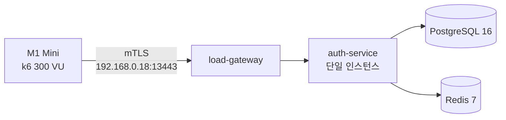

# 원격 부하 테스트 결과 — 2026-09-06

## 결론

> **M1 Mini에서 생성한 300 동시 VU의 OIDC 부하를 단일 `auth-service`가 180초 측정 구간 동안 정의된 k6 성능 SLO 이내로 처리했다.**
>
> 검증된 결론은 **300 VU 단기 probe 통과**다. 30분 soak를 수행한 결과가 아니므로 300 VU를 운영 최대 용량이나 장기 안정성이 확인된 용량으로 해석하지 않는다.

| 판정 항목                    | 300 VU 결과                 | 기준        | 판정 |
| ---------------------------- | --------------------------- | ----------- | ---- |
| 측정 요청                    | 40,935건                    | `> 0`       | PASS |
| 측정 처리량                  | 227.42 RPS                  | 관측값      | PASS |
| 전체 요청 p95                | 583.26ms                    | `< 1,000ms` | PASS |
| 전체 요청 p99                | 853.97ms                    | `< 2,000ms` | PASS |
| 요청 실패율                  | 0%                          | `< 1%`      | PASS |
| 정상 흐름 체크 실패          | 0건                         | `0건`       | PASS |
| 부하 하네스 실패율           | 0%                          | `= 0%`      | PASS |
| 가장 느린 엔드포인트 p95/p99 | refresh 856.51ms/1,074.25ms | 동일 기준   | PASS |

## 시험 구성

부하 생성기와 시험 대상을 서로 다른 장비로 분리했다. M1 Mini의 k6가 LAN의 mTLS gateway에 접속하고, gateway가 전용 Compose 네트워크의 단일 `auth-service`로 요청을 전달했다. 서비스는 전용 PostgreSQL과 Redis를 사용했다.



| 항목          | 값                           |
| ------------- | ---------------------------- |
| 실행 모드     | M1 Mini 외부 부하 생성       |
| 대상          | `auth-service` 단일 인스턴스 |
| 전송 경로     | LAN + 상호 TLS gateway       |
| k6 이미지     | `grafana/k6:2.2.0`           |
| 목표 부하     | 300 VU                       |
| 워밍업        | 60초 동안 0 → 300 VU ramp-up |
| 측정          | 300 VU에서 180초             |
| 전체 실행시간 | 244.17초                     |
| 측정 시작     | `2026-09-05T11:41:51.493Z`   |
| 서비스 메모리 | Docker container limit 2GiB  |

## SLO와 판정 범위

이 보고서는 k6 summary가 직접 증명하는 요청·프로토콜 지표를 평가한다.

| SLO                      |        기준 |                      결과 |
| ------------------------ | ----------: | ------------------------: |
| 측정 요청 실패율         |      `< 1%` |                        0% |
| 정상 흐름 체크 실패      |       `0건` |                       0건 |
| 전체 요청 p95            | `< 1,000ms` |                  583.26ms |
| 전체 요청 p99            | `< 2,000ms` |                  853.97ms |
| 모든 관측 엔드포인트 p95 | `< 1,000ms` |   최대 856.51ms — refresh |
| 모든 관측 엔드포인트 p99 | `< 2,000ms` | 최대 1,074.25ms — refresh |
| 부하 하네스 실패율       |      `= 0%` |                        0% |

원격 k6 summary에는 Auth PC 컨테이너의 구간별 CPU·메모리, 재시작 횟수, PostgreSQL·Redis 오류 카운터가 포함되지 않는다. 따라서 이 문서는 해당 운영 지표가 0이었다고 주장하지 않는다. 이 항목과 장기 안정성은 Auth PC 모니터를 함께 실행하는 30분 soak에서 별도로 검증해야 한다.

## 처리량

측정 구간에서 40,935건을 180초 동안 처리했다.

```text
40,935 requests / 180 seconds = 227.42 RPS
```

k6 summary의 Counter `rate`는 워밍업과 종료 정리를 포함한 전체 실행시간 244.17초로 나눈 값이다. 용량 판정에는 워밍업을 제외한 실제 측정 구간의 요청 수를 사용하므로 이 보고서는 `load_requests.count / 180`으로 처리량을 계산한다.

전체 HTTP 요청 수 52,041건에는 워밍업과 OIDC 흐름을 구성하는 요청이 포함된다. 성능 SLO에 사용한 `load_requests` 40,935건은 180초 측정 구간에서 수집된 요청이다.

## 엔드포인트별 결과

모든 엔드포인트가 p95 1초, p99 2초 기준을 통과했다. Refresh token rotation이 가장 느렸지만 p95와 p99 모두 SLO 안에 있었다.

| 엔드포인트    |    요청 수 |         평균 |          p95 |          p99 |           최대 | 판정     |
| ------------- | ---------: | -----------: | -----------: | -----------: | -------------: | -------- |
| login         |     18,304 |     240.87ms |     662.37ms |     920.75ms |     1,239.37ms | PASS     |
| introspection |     10,203 |     163.18ms |     394.77ms |     529.81ms |       655.33ms | PASS     |
| userinfo      |      5,644 |     171.52ms |     397.06ms |     526.67ms |       639.50ms | PASS     |
| refresh       |      2,753 |     384.20ms |     856.51ms |   1,074.25ms |     1,262.66ms | PASS     |
| discovery     |      1,740 |      74.28ms |     207.19ms |     320.91ms |       378.46ms | PASS     |
| jwks          |      1,147 |      75.18ms |     227.97ms |     332.39ms |       368.44ms | PASS     |
| revoke        |      1,144 |     179.13ms |     412.53ms |     543.20ms |       672.97ms | PASS     |
| **전체**      | **40,935** | **208.13ms** | **583.26ms** | **853.97ms** | **1,262.66ms** | **PASS** |

엔드포인트 요청 수의 합계는 전체 측정 요청 40,935건과 일치한다. 또한 1,144개의 로그인 흐름이 끝까지 완료됐다.

## 오류와 체크

| 지표                        |                관측값 |
| --------------------------- | --------------------: |
| `load_request_failed` rate  |                    0% |
| `http_req_failed` rate      |                    0% |
| `checks`                    | 111,049 PASS / 0 FAIL |
| `load_check_failed` rate    |                    0% |
| `load_harness_failure` rate |                    0% |

k6의 Rate metric에서 `rate=0`인 실패 지표는 실패가 발생하지 않았다는 뜻이다. Raw summary의 `fails` 필드는 `false`로 기록된 샘플 수이므로, 이름이 `*_failed`인 Rate metric에서 실제 실패 건수로 읽으면 안 된다.

## 실제 OIDC 부하 구성

각 VU는 Authorization Code + PKCE 로그인을 수행한 뒤 다음 동작을 가중치에 따라 반복했다.

| 동작                       | 비율 |
| -------------------------- | ---: |
| Opaque token introspection |  45% |
| UserInfo                   |  25% |
| Refresh token rotation     |  12% |
| Discovery                  |   8% |
| JWKS                       |   5% |
| Revoke/logout + relogin    |   5% |

OIDC authorization, token exchange, PKCE, session/interaction 처리는 `node-oidc-provider`의 실제 endpoint를 사용했다. 테스트를 위해 프로토콜 검증을 우회하지 않았다.

## 해석과 운영 기준

이번 결과가 직접 지지하는 내용은 다음과 같다.

1. 단일 `auth-service`는 시험 환경에서 300개의 동시 활성 VU를 180초 동안 처리했다.
2. 측정 처리량은 227.42 RPS였고 요청·체크 실패가 없었다.
3. 전체 및 엔드포인트별 p95/p99가 정의된 성능 SLO 안에 있었다.

다음 내용은 아직 증명되지 않았다.

- 300 VU를 30분 이상 유지할 때의 안정성
- 300 VU가 서비스의 절대 최대 동시 사용자 수라는 결론
- 운영 트래픽에서 동일한 하드웨어·데이터 크기·외부 의존성을 사용할 때의 동일 성능
- 테스트 구간의 컨테이너 재시작, OOM, CPU·메모리 피크 및 DB·Redis 오류가 모두 0이라는 결론

따라서 현재 운영 계획에서는 **300 VU를 검증된 단기 부하 기준**으로 기록한다. 운영 상한이나 용량 여유율을 확정하려면 동일한 300 VU로 Auth PC 모니터를 동반한 1,800초 soak를 통과해야 한다.

## 재현 방법과 원본 증거

M1 Mini의 `$HOME/auth-loadgen`에서 실행한다.

```sh
scripts/run-remote-loadgen.sh verify --target-ip 192.168.0.18
scripts/run-remote-loadgen.sh probe \
  --target-ip 192.168.0.18 \
  --vus 300 \
  --warmup-seconds 60 \
  --measure-seconds 180
```

원본 k6 JSON은 M1 Mini의 `load-tests/results/remote/` 아래에 보존한다. 이 보고서의 수치는 측정 epoch `1788608511493`인 operator-provided summary에서 필요한 지표만 추출해 반올림했다. 토큰, 쿠키, 비밀번호, 인증서 private key, PKCE verifier 같은 런타임 비밀값은 문서에 포함하지 않는다.
