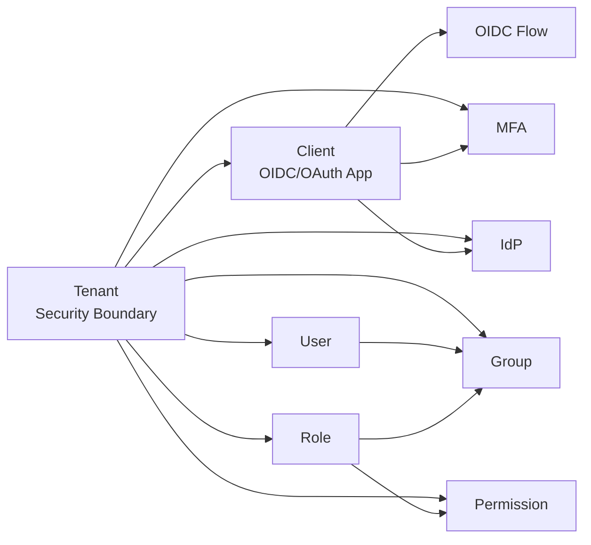
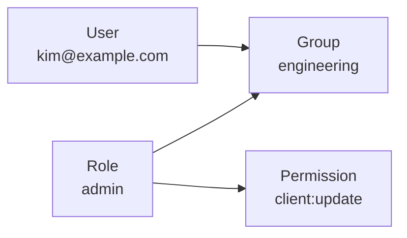

# Core Concepts

| Item            | Description                                                                                 |
| --------------- | ------------------------------------------------------------------------------------------- |
| Purpose         | Explains the relationship between core domain concepts and links to detailed concept pages. |
| Audience        | Administrators, operators, and authentication server developers                             |
| Related Screens | Tenants, Clients, Policies, Identity Providers, Roles, Groups, Users, Interaction UI        |

## Overall Relationship

The Auth system uses Tenant as the outer security boundary. Clients, users, groups, roles, and permissions are managed inside a tenant.



| Concept    | Short Definition                                                                     |
| ---------- | ------------------------------------------------------------------------------------ |
| Tenant     | Boundary that separates customers, organizations, or services inside the auth server |
| Client     | Application that initiates OIDC/OAuth authentication                                 |
| OIDC Flow  | Browser-based authentication flow that issues authorization code and tokens          |
| User       | Person or account being authenticated                                                |
| Group      | Organization or operational unit containing users                                    |
| Role       | Bundle of permissions                                                                |
| Permission | Concrete action or resource access unit                                              |
| MFA        | Additional authentication factor required by tenant/client policy                    |
| IdP        | External identity provider used for SSO authentication                               |

## Detailed Concept Pages

| Document                                               | Description                                                               |
| ------------------------------------------------------ | ------------------------------------------------------------------------- |
| [OIDC Flow](./concepts/oidc-flow.md)                   | Tenant issuer and Authorization Code + PKCE flow                          |
| [Tenant Overview](./concepts/tenant/overview.md)       | Tenant security boundary, issuer, and isolation scope                     |
| [Tenant Policies](./concepts/tenant/policies.md)       | Tenant-level authentication, MFA, session, and signup policies            |
| [Client Overview](./concepts/client/overview.md)       | Client types, redirect URIs, logout URIs, and main attributes             |
| [Client Policies](./concepts/client/policies.md)       | Client authentication policies and effective policy calculation           |
| [Grant Overview](./concepts/client/grants/overview.md) | Grant type policy and validation rules                                    |
| [Custom Grant](./concepts/client/grants/custom.md)     | How to add a custom OAuth `grant_type`                                    |
| [Scope Overview](./concepts/client/scopes.md)          | Scope and resource indicator behavior                                     |
| [MFA Overview](./concepts/mfa.md)                      | MFA methods, enrollment, and interaction verification                     |
| [IdP Overview](./concepts/idp.md)                      | External IdP connection model, protocol settings, and policy restrictions |
| [Custom IdP](./concepts/idp/custom.md)                 | Rules for OAuth2/OIDC-style and SAML 2.0 custom IdPs                      |

## RBAC

RBAC means Role Based Access Control. Instead of assigning fine-grained permissions directly to users, permissions are assigned through roles.



Meaning:

1. A user belongs to one or more groups.
2. One or more roles are assigned to a group.
3. One or more permissions are assigned to a role.
4. A user receives permissions through roles assigned to their groups.

## Direct User Roles

The system also supports assigning roles directly to users.

```text
User <- Role -> Permission
```

Operationally, group-based assignment is preferred.

| Pattern                 | Recommendation | Reason                                                         |
| ----------------------- | -------------- | -------------------------------------------------------------- |
| `User -> Group <- Role` | Default        | Easier organization-level management, auditing, and revocation |
| `User <- Role`          | Exceptional    | Temporary access or special accounts                           |

## Operating Principles

| Principle                            | Description                                                                                            |
| ------------------------------------ | ------------------------------------------------------------------------------------------------------ |
| Select tenant first                  | Tenant-scoped resources are managed after selecting a tenant.                                          |
| Client per app boundary              | Separate clients per application or security posture.                                                  |
| MFA depends on policy and enrollment | Tenant/client policy decides whether MFA is required; user state decides whether enrollment is needed. |
| IdP is tenant-scoped                 | Manage external provider secrets and certificates per tenant.                                          |
| Roles are permission bundles         | Do not create roles per individual user.                                                               |
| Groups represent organizations       | Use teams or operational units as groups.                                                              |
| Keep permissions small               | Model permissions close to concrete actions.                                                           |
| Minimize direct user roles           | Prefer assigning roles to groups.                                                                      |
