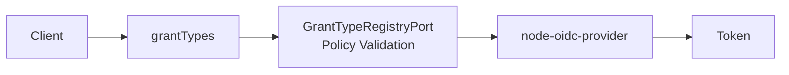

# Grant Overview

A client's `grantTypes` define which OAuth/OIDC flows the client can use at the authorization endpoint or token endpoint.

:::info
This page discusses the client metadata `grantTypes` policy. It is different from the `node-oidc-provider` `Grant` model that stores user consent.
:::

## Grant Types

| Grant Type             | Purpose                                                        | Recommended Client Type     | Main Condition                           |
| ---------------------- | -------------------------------------------------------------- | --------------------------- | ---------------------------------------- |
| `authorization_code`   | User logs in through a browser and exchanges a code for tokens | `public`, `confidential`    | PKCE `S256` required                     |
| `refresh_token`        | Reissue access tokens after expiration                         | `public`, `confidential`    | Must be paired with `authorization_code` |
| `client_credentials`   | Issue tokens for service-to-service access without a user      | `confidential`, `service`   | Client authentication required           |
| `implicit`             | Legacy flow that returns tokens directly to the browser        | Avoid                       | Not recommended for new clients          |
| `urn:...` custom grant | Service-defined custom token flow                              | Depends on grant definition | Follow [Custom Grant](./custom.md)       |

## Recommended Combinations

| Scenario            | Client Type           | Application Type            | Grant Types                                      | Token Endpoint Auth Method                    |
| ------------------- | --------------------- | --------------------------- | ------------------------------------------------ | --------------------------------------------- |
| SPA / mobile app    | `public`              | `web` or `native`           | `authorization_code`, optionally `refresh_token` | `none`                                        |
| Server-side web app | `confidential`        | `web`                       | `authorization_code`, optionally `refresh_token` | `client_secret_basic` or `client_secret_post` |
| Service-to-service  | `service`             | `web`                       | `client_credentials`                             | `client_secret_basic` or `client_secret_post` |
| Custom extension    | Prefer `confidential` | Depends on grant definition | `urn:...`                                        | Depends on grant definition                   |

## Response Types

| Response Type | Meaning                         | Recommendation |
| ------------- | ------------------------------- | -------------- |
| `code`        | Return an authorization code    | Default        |
| `token`       | Return an access token directly | Avoid          |
| `id_token`    | Return an ID token directly     | Avoid          |

Authorization Code + PKCE usually uses `responseTypes: ["code"]`.

## Token Endpoint Auth Method

| Value                 | Meaning                                                  | Recommended Client    |
| --------------------- | -------------------------------------------------------- | --------------------- |
| `none`                | No client secret; protected by PKCE and related controls | public                |
| `client_secret_basic` | Send client secret via HTTP Basic                        | confidential, service |
| `client_secret_post`  | Send client secret in request body                       | confidential, service |
| `private_key_jwt`     | Sign a client assertion with a private key               | confidential, service |

## Validation Policy

When a client is saved, `GrantTypeRegistryPort` validates `grantTypes`.

| Validation            | Description                                                                |
| --------------------- | -------------------------------------------------------------------------- |
| Supported             | Only built-in grants or registered `urn:...` custom grants are allowed     |
| Enabled               | Disabled grants cannot be assigned                                         |
| Client Type           | Must match the grant's allowed client types                                |
| Application Type      | Must match the grant's allowed application types                           |
| Client Authentication | Grants requiring authentication cannot use `tokenEndpointAuthMethod: none` |
| Required Grant        | `refresh_token` requires `authorization_code`                              |

## Operating Rules

| Rule            | Description                                                  |
| --------------- | ------------------------------------------------------------ |
| Least privilege | Enable only grants that the client actually uses             |
| Public client   | Do not use `client_credentials`                              |
| Service client  | Separate from user login flows and keep scopes narrow        |
| Legacy flows    | Avoid `implicit` for new integrations                        |
| Custom grant    | Enable only after implementation, security review, and tests |

## Related Docs

| Document                          | Description                            |
| --------------------------------- | -------------------------------------- |
| [Client Overview](../overview.md) | Main client attributes                 |
| [Custom Grant](./custom.md)       | How to add a custom OAuth `grant_type` |
| [Scope Overview](../scopes.md)    | Scope and resource indicator behavior  |
| [OIDC Flow](../../oidc-flow.md)   | Authorization Code + PKCE flow         |
