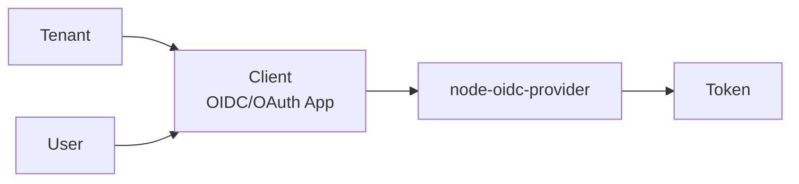

# Client Overview

A Client is an application that initiates OIDC/OAuth authentication. Web services, mobile apps, admin consoles, server-side applications, and machine-to-machine workloads can all be clients.

A client always belongs to a specific [Tenant](../tenant/overview.md).



:::info
A client is an application-level security boundary. If one product has different security postures such as public user web, admin console, and batch jobs, split them into separate clients.
:::

## Client Type

| Type           | Typical Use         | Characteristic                                   | Recommended Grant                     |
| -------------- | ------------------- | ------------------------------------------------ | ------------------------------------- |
| `public`       | SPA, mobile app     | Cannot safely keep a secret                      | `authorization_code` + PKCE           |
| `confidential` | Server-side web app | Can keep a secret on the server                  | `authorization_code`, `refresh_token` |
| `service`      | Machine-to-machine  | No user browser; server-to-server token issuance | `client_credentials`                  |

## Application Type

| Value    | Meaning                                         |
| -------- | ----------------------------------------------- |
| `web`    | Server-side web app, SPA, or general web client |
| `native` | Mobile or desktop native client                 |

Grant policy validation considers both client type and application type.

## Main Attributes

| Attribute                 | Meaning                                                   | Detail                                 |
| ------------------------- | --------------------------------------------------------- | -------------------------------------- |
| `clientId`                | External OIDC `client_id`                                 | This page                              |
| `name`                    | Display name in Admin UI                                  | This page                              |
| `enabled`                 | Whether the client can be used                            | This page                              |
| `secret` / `secretEnc`    | Secret for confidential/service clients. Stored encrypted | This page                              |
| `redirectUris`            | Callback URIs that receive authorization codes            | This page                              |
| `postLogoutRedirectUris`  | Allowed URIs after logout                                 | This page                              |
| `grantTypes`              | OAuth grant flows allowed for this client                 | [Grant Overview](./grants/overview.md) |
| `responseTypes`           | Authorization endpoint response modes                     | [Grant Overview](./grants/overview.md) |
| `tokenEndpointAuthMethod` | How the client authenticates at the token endpoint        | [Grant Overview](./grants/overview.md) |
| `scope`                   | Scopes this client can request                            | [Scope Overview](./scopes.md)          |
| `allowedResources`        | Resource indicator origins this client can request        | [Scope Overview](./scopes.md)          |
| `skipConsent`             | Whether trusted clients can skip consent                  | [Client Policies](./policies.md)       |
| `accessTokenTtlSec`       | Client-specific access token TTL override                 | [Client Policies](./policies.md)       |
| `refreshTokenTtlSec`      | Client-specific refresh token TTL override                | [Client Policies](./policies.md)       |
| `backchannelLogoutUri`    | Back-channel logout notification URI                      | This page                              |
| `frontchannelLogoutUri`   | Front-channel logout notification URI                     | This page                              |

## Client ID

`clientId` identifies the client in OIDC/OAuth requests.

```text
client_id=my-web-app
```

Operational rules:

- Treat it as immutable after creation.
- It is not a secret and can appear in URLs.
- It must be unique inside a tenant.
- Prefer names that humans can identify.

## Redirect URI

`redirectUris` are callback URIs that receive authorization codes after the authorization code flow.

| Rule                 | Description                                                         |
| -------------------- | ------------------------------------------------------------------- |
| Exact match          | Scheme, host, path, and port must match the registered value.       |
| HTTPS                | Use HTTPS in production. Localhost development can be an exception. |
| Minimal registration | Register only callbacks that are actually used.                     |
| Avoid wildcards      | Broad redirect patterns increase code theft risk.                   |

:::caution
Do not reimplement redirect URI validation in application code. Delegate it to the OIDC provider.
:::

## Logout URI

| Attribute                | Meaning                                    |
| ------------------------ | ------------------------------------------ |
| `postLogoutRedirectUris` | URI to return to after RP initiated logout |
| `backchannelLogoutUri`   | Server-to-server logout notification URI   |
| `frontchannelLogoutUri`  | Browser-based logout notification URI      |

Use HTTPS in production and separate login callbacks from logout callbacks when possible.

## Operating Checklist

| Check                 | Rule                                                                     |
| --------------------- | ------------------------------------------------------------------------ |
| Split by app boundary | Separate public web, admin console, and M2M clients                      |
| Minimize redirects    | Register only real callback URIs                                         |
| Minimize grants       | Do not enable unused grant types                                         |
| Minimize scopes       | Allow only necessary scopes                                              |
| Public client         | No secret, PKCE required                                                 |
| Service client        | Separate from user login scopes                                          |
| Token logging         | Never log authorization codes, access tokens, refresh tokens, or secrets |
