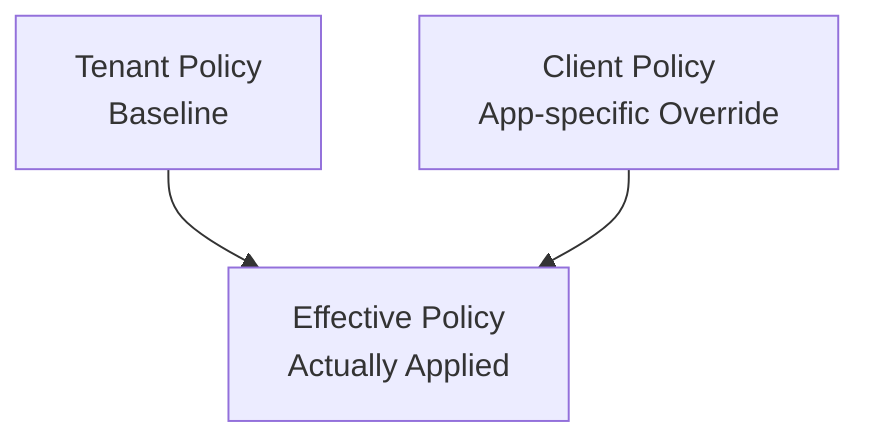

# Client Policies

Client policies tune authentication methods, MFA, consent, session, and refresh token behavior for a specific client. Tenant policies provide defaults; client policies narrow or specialize them.

## Authentication Methods

| Field                | Default        | Description                                         |
| -------------------- | -------------- | --------------------------------------------------- |
| `allowedAuthMethods` | `["password"]` | User authentication methods allowed for this client |
| `defaultAcr`         | `urn:auth:pwd` | Default Authentication Context Class Reference      |

Allowed `allowedAuthMethods` values:

| Value        |
| ------------ |
| `password`   |
| `totp`       |
| `webauthn`   |
| `magic_link` |

## MFA

See [MFA Overview](../mfa.md) for supported methods, enrollment, and Interaction UI verification flow.

| Field               | Default    | Description                         |
| ------------------- | ---------- | ----------------------------------- |
| `mfaRequired`       | `false`    | Require MFA for this client         |
| `allowedMfaMethods` | `["totp"]` | MFA methods allowed for this client |

Allowed MFA method values:

| Value           |
| --------------- |
| `totp`          |
| `webauthn`      |
| `recovery_code` |

If tenant MFA is required, effective MFA remains required even when `mfaRequired` is false on the client.

## Consent

| Field             | Default         | Description                                              |
| ----------------- | --------------- | -------------------------------------------------------- |
| `consentRequired` | `true`          | Whether to show a scope consent screen                   |
| `skipConsent`     | client metadata | Whether trusted clients can automatically create a Grant |

Keep consent enabled for external or third-party clients. Before skipping consent for first-party clients, review the trust boundary and requested scopes.

## Session / Reauthentication

| Field                         | Default | Description                                              |
| ----------------------------- | ------- | -------------------------------------------------------- |
| `maxSessionDurationSec`       | `null`  | Client-specific max session lifetime override            |
| `requireAuthTime`             | `false` | Require authentication time verification for this client |
| `reauthenticationIntervalSec` | `null`  | Client-specific reauthentication interval                |

If tenant `requireAuthTime` is true, the client cannot weaken it.

## Client-specific IdP Restriction

See [IdP Overview](../idp.md) for provider keys and supported external identity protocols.

| Field                    | Default | Description                               |
| ------------------------ | ------- | ----------------------------------------- |
| `allowedIdpProviderKeys` | `null`  | IdP provider keys allowed for this client |

`null` means the client follows the tenant-level IdP policy. An empty array can mean no IdP is allowed, so use it carefully with authentication method settings.

## Refresh Token

| Field                         | Default        | Description                                    |
| ----------------------------- | -------------- | ---------------------------------------------- |
| `refreshTokenRotationEnabled` | `true`         | Client-specific refresh token rotation setting |
| `refreshTokenReuseAction`     | `revoke_grant` | Action when reuse is detected                  |
| `refreshTokenTtlSec`          | tenant default | Client-specific refresh token TTL override     |

Public clients have higher refresh token theft risk, so keep rotation enabled. Raw refresh tokens must not be logged.

## Effective Policy

The `effective` field in the client auth policy response is what the login/session flow actually applies.

| Effective Field               | Calculation                                                                |
| ----------------------------- | -------------------------------------------------------------------------- |
| `mfaRequired`                 | `tenant.mfa.required OR client.mfaRequired`                                |
| `allowedIdpProviderKeys`      | client value if present, otherwise tenant value                            |
| `maxSessionDurationSec`       | client value if present, otherwise tenant value                            |
| `requireAuthTime`             | `tenant.session.requireAuthTime OR client.requireAuthTime`                 |
| `reauthenticationIntervalSec` | client value if present, otherwise tenant value                            |
| `refreshTokenTtlSec`          | client `refreshTokenTtlSec` if present, otherwise tenant refresh token TTL |

## Related Docs

| Document                                 | Description                                    |
| ---------------------------------------- | ---------------------------------------------- |
| [MFA Overview](../mfa.md)                | Client MFA requirement and allowed methods     |
| [IdP Overview](../idp.md)                | Client-specific external provider restrictions |
| [Tenant Policies](../tenant/policies.md) | Tenant baseline policy                         |
