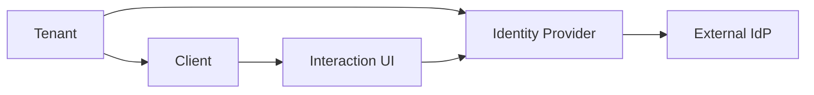
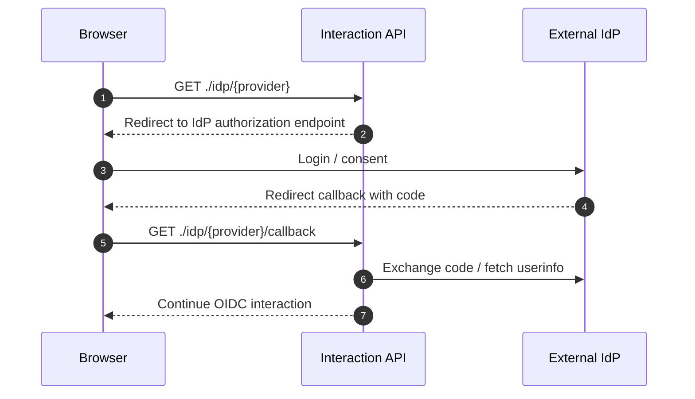

# IdP Overview

IdP stands for Identity Provider. Instead of verifying the user's password directly, the Auth system can authenticate users through an external provider such as Google, Okta, workforce SSO, or a SAML IdP.

## Supported Protocols

| Protocol               | Use Case                                            | Main Settings                                                        |
| ---------------------- | --------------------------------------------------- | -------------------------------------------------------------------- |
| OAuth 2.0 / OIDC-style | Google, Kakao, Naver, Apple, custom OAuth providers | client ID, client secret, authorization/token/userinfo endpoint      |
| SAML 2.0               | Okta, Azure AD, workforce SAML SSO                  | SSO URL, IdP certificate, issuer, audience, assertion signing policy |

:::caution
Do not write OAuth client secrets, SAML private material, or IdP token responses to UI logs, application logs, or audit metadata.
:::

## Tenant and IdP

IdP settings are isolated per tenant. Even if two tenants both connect to Google or Okta, each tenant manages its own provider key, client ID, secret, and certificate.

## Provider Key

The `provider key` is the slug that identifies an IdP inside a tenant.

| Rule     | Description                                                                                   |
| -------- | --------------------------------------------------------------------------------------------- |
| Examples | `google`, `okta-workforce`, `corp-saml`                                                       |
| Display  | Connected to external login buttons in the Interaction UI                                     |
| Policy   | Referenced by tenant/client policy fields such as `providerKeys` and `allowedIdpProviderKeys` |

## OAuth2 IdP

An OAuth2-based IdP redirects the browser to the authorization endpoint, then receives a code on the callback and fetches token/userinfo data.

## SAML 2.0 IdP

For SAML IdPs, Service Provider metadata, ACS callback handling, and assertion verification policies are the critical settings.

| Setting                     | Meaning                                                     |
| --------------------------- | ----------------------------------------------------------- |
| `IdP SSO URL`               | Endpoint that receives SAML login requests                  |
| `IdP certificate`           | Certificate used to verify assertion or response signatures |
| `Audience`                  | SP identifier targeted by the assertion                     |
| `Require signed assertions` | Whether assertions must be signed                           |
| `Require signed response`   | Whether responses must be signed                            |
| `Accepted clock skew`       | Allowed time drift during assertion validation              |

In production, signature verification for assertions or responses should remain enabled.

## Client Policy and IdP Restrictions

Tenant policy defines which IdPs are allowed across the tenant. Client policy can narrow that list for a specific client.

| Policy                           | Meaning                            |
| -------------------------------- | ---------------------------------- |
| `tenant.allowedIdp.providerKeys` | IdPs allowed across the tenant     |
| `client.allowedIdpProviderKeys`  | IdPs allowed for a specific client |

If `client.allowedIdpProviderKeys` is `null`, the client follows the tenant policy.

## Related Docs

| Document                                          | Description                                          |
| ------------------------------------------------- | ---------------------------------------------------- |
| [Custom IdP](./idp/custom.md)                     | Rules for OAuth2/OIDC-style and SAML 2.0 custom IdPs |
| [Identity Providers](../ui/identity-providers.md) | Admin UI IdP configuration screen                    |
| [Tenant Policies](./tenant/policies.md)           | Tenant allowed IdP policy                            |
| [Client Policies](./client/policies.md)           | Client-specific IdP restrictions                     |
| [OIDC Flow](./oidc-flow.md)                       | Interaction and external IdP flow                    |
