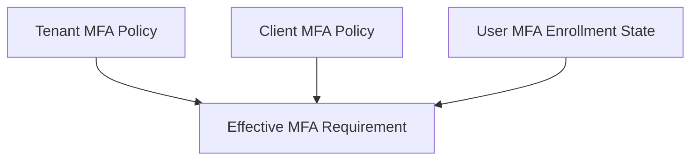
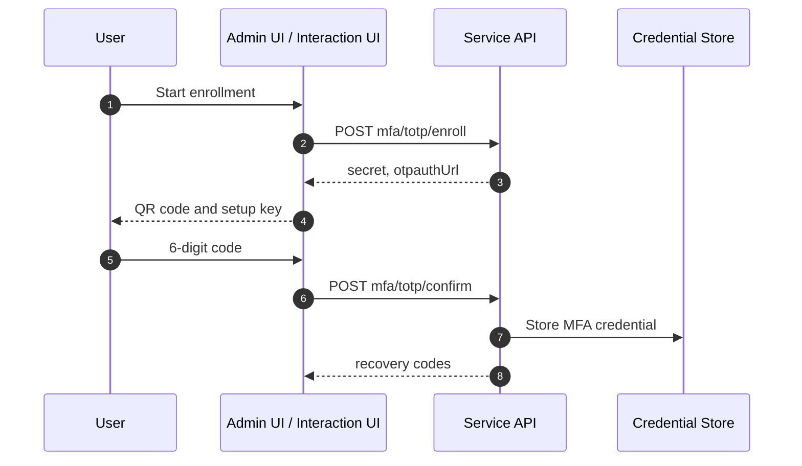

# MFA Overview

MFA stands for Multi-Factor Authentication. Instead of relying only on a primary factor such as a password, the system verifies an additional factor controlled by the user to reduce account takeover risk.

## Supported Methods

| Method          | Meaning                                                 | Used In                                    |
| --------------- | ------------------------------------------------------- | ------------------------------------------ |
| `totp`          | Six-digit one-time code from an authenticator app       | Admin UI security settings, Interaction UI |
| `webauthn`      | Browser/device-based public key authentication          | Interaction MFA verification               |
| `recovery_code` | Backup code used when another MFA method is unavailable | Admin UI security settings, Interaction UI |

:::caution
Do not write TOTP secrets, raw WebAuthn credential material, or raw recovery codes to logs, audit metadata, or error responses.
:::

## Policy Layers

MFA requirements are determined across three layers.

| Layer         | Description                                                         |
| ------------- | ------------------------------------------------------------------- |
| Tenant policy | Requires MFA for all tenant users or administrators                 |
| Client policy | Requires MFA for a specific client or restricts allowed MFA methods |
| User state    | Whether the user has enrolled MFA and still has recovery codes      |

If tenant MFA is required, a client cannot disable MFA.

## Enrollment Flow

TOTP enrollment lets the user register a secret in an authenticator app, verify a code, and then activate MFA.

Operational rules:

- Show `otpauthUrl` and the secret only on the enrollment screen.
- Show recovery codes once immediately after issuance and tell the user to store them safely.
- When recovery codes are regenerated, revoke the previous codes.

## Interaction MFA

When MFA is required during OIDC authorization, the Interaction UI moves to the MFA screen.

| Situation                                    | Behavior                             |
| -------------------------------------------- | ------------------------------------ |
| MFA required and user has enrolled MFA       | Verify MFA with `POST ./api/mfa`     |
| MFA required and user has no enrolled method | Show the TOTP enrollment screen      |
| Recovery code used                           | Verify and consume the recovery code |

## Related Docs

| Document                                                | Description                                         |
| ------------------------------------------------------- | --------------------------------------------------- |
| [Tenant Policies](./tenant/policies.md)                 | Tenant MFA baseline policy                          |
| [Client Policies](./client/policies.md)                 | Client-specific MFA requirement and allowed methods |
| [Security](../ui/security.md)                           | User MFA enrollment and recovery code management    |
| [Interaction UI Customization](../ui/interaction-ui.md) | MFA screen customization                            |
