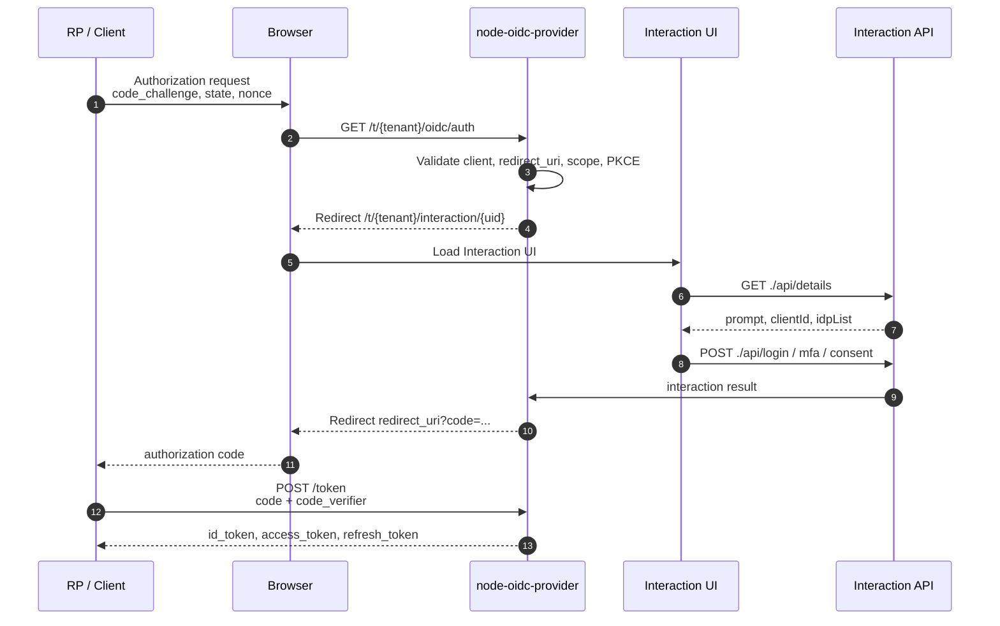

# OIDC Flow

| Item      | Description                                                                                                  |
| --------- | ------------------------------------------------------------------------------------------------------------ |
| Purpose   | Explains the flow from an RP authorization request to code, token, and userinfo.                             |
| Audience  | Auth server developers, client integrators, operators                                                        |
| Main Code | `service/src/infrastructure/oidc-provider`, `service/src/presentation/controllers/interaction.controller.ts` |

## Overview

This service uses `node-oidc-provider` as the OIDC protocol engine. Authorization endpoint, token endpoint, PKCE validation, code issuance, and token signing are handled by the provider. Service code connects tenant isolation, interaction UI, user lookup, client policy, audit, and persistence.

:::info
The recommended default flow is Authorization Code + PKCE. PKCE is required for both public and confidential clients.
:::

## Participants

| Component                | Role                                                                  |
| ------------------------ | --------------------------------------------------------------------- |
| RP / Client              | Starts OIDC login and exchanges authorization code for tokens         |
| Browser                  | Moves through login, consent, and MFA screens                         |
| `OidcDelegateMiddleware` | Delegates `/t/:tenantCode/oidc/*` requests to the tenant provider     |
| `node-oidc-provider`     | Handles OIDC/OAuth2 protocol behavior                                 |
| `InteractionController`  | Provides login, consent, MFA, and external IdP interaction APIs       |
| `service/interaction-ui` | End-user login, consent, and MFA SPA                                  |
| OIDC Adapter             | Stores provider models such as Session, Interaction, Grant, and Token |

## Tenant Issuer

Issuer is separated per tenant.

```text
{OIDC_ISSUER}/t/{tenantCode}/oidc
```

Discovery:

```text
GET /t/:tenantCode/oidc/.well-known/openid-configuration
```

## Authorization Code + PKCE



## Interaction API

Provider redirects to the interaction path when user input is required.

```text
/t/:tenantCode/interaction/:uid
```

The Interaction UI calls APIs below the same pathname.

```text
GET  ./api/details
POST ./api/login
POST ./api/mfa
POST ./api/mfa/totp/enroll
POST ./api/mfa/totp/confirm
POST ./api/consent
GET  ./api/abort
GET  ./idp/:provider
```

## Token Exchange

The RP exchanges the returned code at the token endpoint.

```text
POST /t/:tenantCode/oidc/token
Content-Type: application/x-www-form-urlencoded

grant_type=authorization_code
&client_id=web
&code=...
&redirect_uri=https%3A%2F%2Fapp.example.com%2Fcallback
&code_verifier=...
```

The provider validates code lifetime, code reuse, redirect URI binding, PKCE verifier, client authentication, and allowed grant type.

## UserInfo

```text
GET /t/:tenantCode/oidc/userinfo
Authorization: Bearer {access_token}
```

Default claims:

| Claim            | Description              |
| ---------------- | ------------------------ |
| `sub`            | User subject identifier  |
| `email`          | Email address            |
| `email_verified` | Email verification state |

Sensitive information, credentials, and internal policy state must not be exposed as claims.

## Security Rules

| Rule               | Description                                                        |
| ------------------ | ------------------------------------------------------------------ |
| PKCE               | Required for authorization code flow, `S256` only                  |
| Redirect URI       | Delegated to provider validation and must exactly match metadata   |
| Tenant binding     | Issuer, provider instance, and storage lookup are tenant-scoped    |
| Token logging      | Never log access tokens, refresh tokens, or authorization codes    |
| Resource indicator | Allow HTTPS origins only and compare with client allowed resources |
