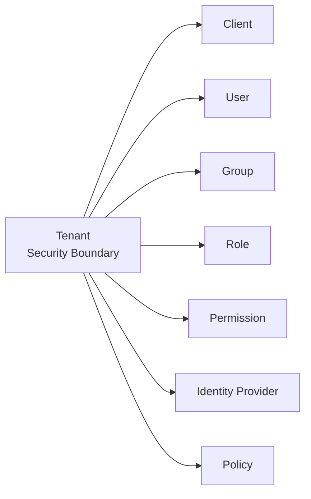

# Tenant Overview

Tenant is the top-level security boundary that separates customers, organizations, or services inside the Auth system. A tenant owns its clients, users, groups, roles, permissions, policies, and identity provider settings.



:::caution
A tenant is not just a UI filter. Tokens, clients, users, roles, and policies must all be interpreted inside the tenant boundary. Cross-tenant access must be blocked.
:::

## Examples

| Tenant      | Meaning                                        |
| ----------- | ---------------------------------------------- |
| `master`    | System operation or default admin tenant       |
| `acme`      | Authentication realm for the Acme organization |
| `partner-a` | Authentication realm for a partner service     |

## What Tenant Separates

| Resource                  | Isolation Meaning                                        |
| ------------------------- | -------------------------------------------------------- |
| Client                    | OIDC/OAuth clients are registered per tenant             |
| User                      | Accounts are managed inside a tenant                     |
| Group / Role / Permission | RBAC policy is isolated per tenant                       |
| Identity Provider         | OAuth2/SAML IdP settings are tenant-specific             |
| Consent                   | User consent is managed by tenant, user, and client      |
| Audit Log                 | Admin actions and security events are traced by tenant   |
| Policy                    | Authentication, MFA, session, and refresh token defaults |

## Tenant Issuer

The OIDC issuer is separated by tenant path.

```text
{OIDC_ISSUER}/t/{tenantCode}/oidc
```

Example:

```text
http://localhost:3000/t/acme/oidc
```

Clients should discover authorization, token, userinfo, and JWKS endpoints from the tenant discovery document.

```text
GET /t/:tenantCode/oidc/.well-known/openid-configuration
```

## Tenant Code

`tenantCode` appears in URLs and issuer values.

| Rule       | Description                                       |
| ---------- | ------------------------------------------------- |
| Stability  | Treat it as immutable after creation.             |
| URL safety | Prefer lowercase letters, numbers, and hyphens.   |
| Exposure   | Do not put secrets or internal credentials in it. |

## Related Docs

| Document                         | Description                          |
| -------------------------------- | ------------------------------------ |
| [Tenant Policies](./policies.md) | Tenant-level policy defaults         |
| [Tenants](../../ui/tenants.md)   | Tenant management screen             |
| [OIDC Flow](../oidc-flow.md)     | Tenant issuer and authorization flow |
