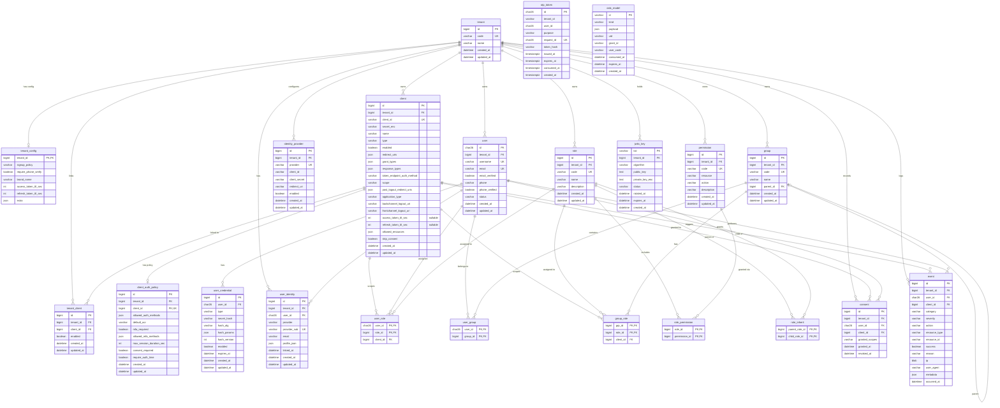

# Database ERD

```mermaid
erDiagram
    tenant {
        bigint id PK
        varchar code UK
        varchar name
        datetime created_at
        datetime updated_at
    }

    tenant_config {
        bigint tenant_id PK,FK
        varchar signup_policy
        boolean require_phone_verify
        varchar brand_name
        int access_token_ttl_sec
        int refresh_token_ttl_sec
        json extra
    }

    client {
        bigint id PK
        bigint tenant_id FK
        varchar client_id UK
        varchar secret_enc
        varchar name
        varchar type
        boolean enabled
        json redirect_uris
        json grant_types
        json response_types
        varchar token_endpoint_auth_method
        varchar scope
        json post_logout_redirect_uris
        varchar application_type
        varchar backchannel_logout_uri
        varchar frontchannel_logout_uri
        int access_token_ttl_sec "nullable"
        int refresh_token_ttl_sec "nullable"
        json allowed_resources
        boolean skip_consent
        datetime created_at
        datetime updated_at
    }

    tenant_client {
        bigint id PK
        bigint tenant_id FK
        bigint client_id FK
        boolean enabled
        datetime created_at
        datetime updated_at
    }

    client_auth_policy {
        bigint id PK
        bigint tenant_id FK
        bigint client_id FK,UK
        json allowed_auth_methods
        varchar default_acr
        boolean mfa_required
        json allowed_mfa_methods
        int max_session_duration_sec
        boolean consent_required
        boolean require_auth_time
        datetime created_at
        datetime updated_at
    }

    user {
        char26 id PK
        bigint tenant_id FK
        varchar username UK
        varchar email UK
        boolean email_verified
        varchar phone
        boolean phone_verified
        varchar status
        datetime created_at
        datetime updated_at
    }

    user_credential {
        bigint id PK
        char26 user_id FK
        varchar type
        varchar secret_hash
        varchar hash_alg
        json hash_params
        int hash_version
        boolean enabled
        datetime expires_at
        datetime created_at
        datetime updated_at
    }

    user_identity {
        bigint id PK
        bigint tenant_id FK
        char26 user_id FK
        varchar provider
        varchar provider_sub UK
        varchar email
        json profile_json
        datetime linked_at
        datetime created_at
        datetime updated_at
    }

    identity_provider {
        bigint id PK
        bigint tenant_id FK
        varchar provider UK
        varchar client_id
        varchar client_secret
        varchar redirect_uri
        boolean enabled
        datetime created_at
        datetime updated_at
    }

    otp_token {
        char26 id PK
        varchar tenant_id
        char26 user_id
        varchar purpose
        char26 request_id UK
        varchar token_hash
        timestamptz issued_at
        timestamptz expires_at
        timestamptz consumed_at
        timestamptz created_at
    }

    role {
        bigint id PK
        bigint tenant_id FK
        varchar code UK
        varchar name
        varchar description
        datetime created_at
        datetime updated_at
    }

    permission {
        bigint id PK
        bigint tenant_id FK
        varchar code UK
        varchar resource
        varchar action
        varchar description
        datetime created_at
        datetime updated_at
    }

    group {
        bigint id PK
        bigint tenant_id FK
        varchar code UK
        varchar name
        bigint parent_id FK
        datetime created_at
        datetime updated_at
    }

    user_role {
        char26 user_id PK,FK
        bigint role_id PK,FK
        bigint client_id FK
    }

    user_group {
        char26 user_id PK,FK
        bigint group_id PK,FK
    }

    group_role {
        bigint grp_id PK,FK
        bigint role_id PK,FK
        bigint client_id FK
    }

    role_permission {
        bigint role_id PK,FK
        bigint permission_id PK,FK
    }

    role_inherit {
        bigint parent_role_id PK,FK
        bigint child_role_id PK,FK
    }

    jwks_key {
        varchar kid PK
        bigint tenant_id FK
        varchar algorithm
        text public_key
        text private_key_enc
        varchar status
        datetime rotated_at
        datetime expires_at
        datetime created_at
    }

    consent {
        bigint id PK
        bigint tenant_id FK
        char26 user_id FK
        bigint client_id FK
        varchar granted_scopes
        datetime granted_at
        datetime revoked_at
    }

    event {
        bigint id PK
        bigint tenant_id FK
        char26 user_id FK
        bigint client_id FK
        varchar category
        varchar severity
        varchar action
        varchar resource_type
        varchar resource_id
        boolean success
        varchar reason
        blob ip
        varchar user_agent
        json metadata
        datetime occurred_at
    }

    oidc_model {
        varchar id PK
        varchar kind
        json payload
        varchar uid
        varchar grant_id
        varchar user_code
        datetime consumed_at
        datetime expires_at
        datetime created_at
    }

    %% Tenant core
    tenant ||--o| tenant_config : "has config"
    tenant ||--o{ client : "owns"
    tenant ||--o{ tenant_client : "links"
    tenant ||--o{ user : "owns"
    tenant ||--o{ role : "owns"
    tenant ||--o{ permission : "owns"
    tenant ||--o{ group : "owns"
    tenant ||--o{ identity_provider : "configures"
    tenant ||--o{ user_identity : "has"
    tenant ||--o{ jwks_key : "holds"
    tenant ||--o{ consent : "records"
    tenant ||--o{ event : "logs"

    %% Client relations
    client ||--o| client_auth_policy : "has policy"
    client ||--o{ tenant_client : "linked to"
    client ||--o{ user_role : "scopes"
    client ||--o{ group_role : "scopes"
    client ||--o{ consent : "granted to"
    client ||--o{ event : "triggers"

    %% User relations
    user ||--o{ user_credential : "has"
    user ||--o{ user_identity : "linked"
    user ||--o{ user_role : "assigned"
    user ||--o{ user_group : "belongs to"
    user ||--o{ consent : "grants"
    user ||--o{ event : "performs"

    %% RBAC
    role ||--o{ user_role : "assigned to"
    role ||--o{ group_role : "assigned to"
    role ||--o{ role_permission : "includes"
    role ||--o{ role_inherit : "parent of"
    role ||--o{ role_inherit : "child of"
    permission ||--o{ role_permission : "granted via"
    group ||--o{ user_group : "contains"
    group ||--o{ group_role : "has"
    group ||--o| group : "parent"
```
